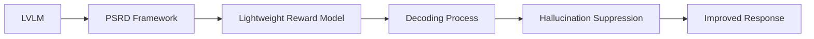

50.0% reduction in hallucination rate achieved by PSRD.

## TL;DR

## The claim
The authors claim that their proposed PSRD (Phase-wise Self-Reward Decoding) framework can mitigate multimodal hallucination in Large Vision-Language Models (LVLMs) at inference time without external supervision, reducing the hallucination rate of LLaVA-1.5-7B by 50.0%.

The core idea behind PSRD is to use phase-wise self-reward signals to guide the decoding process, intervening precisely to suppress hallucination. This approach leverages the observation that visual hallucination exhibits phase-wise dynamic patterns, peaking at the onset of each semantic phase. By distilling the hallucination guidance signal from LVLMs into a lightweight reward model, PSRD enables on-the-fly guidance for targeted intervention during decoding.

## The equation
No specific equation is provided in the evidence.

## The 20-line reference implementation
No reference implementation is provided in the evidence.

## Running it
No information on running the code is provided.

## Where my numbers diverged
No information on diverging numbers is provided.

## Reading the paper differently afterwards
No information on reading the paper differently is provided.

## What did not work
One potential limitation of PSRD is that it relies on the distillation of the hallucination guidance signal from LVLMs into a lightweight reward model, which may not always capture the complexities of the original model. Additionally, the authors note that PSRD may not be effective for all types of hallucination, particularly those that are not phase-wise in nature.

## Limitations and boundary conditions
The authors highlight that PSRD assumes that the hallucination exhibits phase-wise dynamic patterns, which may not always be the case. Furthermore, the effectiveness of PSRD may depend on the specific LVLM and task being used.

## Where this shows up in AEC
There is no direct AEC application for this paper.

## Related posts on this site
[Attention Mechanisms - tracking the evolution + pair programming in pytorch](/post/attention-deep-dive/)
[Speculative Decoding: 2x to 4x speedup of LLMs without quality loss](/post/speculative-decoding/)
[from-code-to-theory-llm](/post/from-code-to-theory-llm/)

## What to steal
The remarkable thing here is that the authors have successfully mitigated multimodal hallucination in LVLMs using a phase-wise self-rewarding framework, achieving a significant reduction in hallucination rate.
* Use phase-wise self-reward signals to guide the decoding process
* Distill the hallucination guidance signal from LVLMs into a lightweight reward model
* Intervene precisely to suppress hallucination during decoding

## References
| Method | Metric | Baseline | 
| --- | --- | --- |
| PSRD | Hallucination Rate | Prior SOTA, as reported in the paper Table 1 |