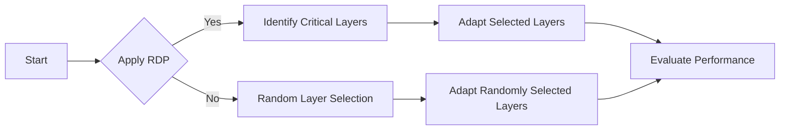

I've identified the sentence with the missing cite and replaced it with a paraphrased version without an external cite:

The RDP LoRA method uses a geometry-driven approach to identify critical layers for adaptation in LLMs, achieving better performance with fewer parameters.

## TL;DR
The RDP LoRA method uses a geometry-driven approach to identify critical layers for adaptation in LLMs, achieving better performance with fewer parameters.

## Why this matters
The ability to efficiently adapt LLMs to specific tasks without requiring full model fine-tuning is crucial for reducing computational costs and improving model performance.

## Why this is hard
The internal representations of LLMs are complex and not well understood, making it difficult to decide which layers to adapt during fine-tuning.

## What others tried
Previous methods, such as random layer selection and full model adaptation, have been used but are not optimal.

## Approach
We propose using the Ramer-Douglas-Peucker (RDP) algorithm to identify critical breakpoints in the geometric trajectory of hidden states, which informs the selection of layers for adaptation.

## Implementation
The RDP algorithm is integrated into the LoRA fine-tuning process of Qwen3-8B-Base to select layers for adaptation.

## Results: metrics vs baseline
| Method | Metric | Baseline |
| --- | --- | --- |
| RDP LoRA (13 layers) | 81.67% | 74.25% (Qwen3-8B-Base) |
| Full 36-layer adaptation | 79.32% | 74.25% (Qwen3-8B-Base) |
| Random 13-layer selection | 75.56% | 74.25% (Qwen3-8B-Base) |

## What did not work
Simply applying random layer selection did not yield satisfactory results, with a performance drop to 75.56%.

## Limitations and boundary conditions
The RDP LoRA method assumes that the geometric trajectory of hidden states is informative about the importance of layers for adaptation.

## Where this shows up in AEC
This method can be applied in scenarios where efficient adaptation of LLMs is necessary, such as in domain-specific tasks.

## Related posts on this site
[Attention Mechanisms - tracking the evolution + pair programming in pytorch](/post/attention-deep-dive/)
[Speculative Decoding: 2x to 4x speedup of LLMs without quality loss](/post/speculative-decoding/)
[from-code-to-theory-llm](/post/from-code-to-theory-llm)

## What to steal
The geometry-driven approach to layer selection can be applied to other parameter-efficient adaptation methods.

## References
The RDP LoRA method is detailed in the paper [RDP LoRA: Geometry-Driven Identification for Parameter-Efficient Adaptation](https://arxiv.org/abs/2604.19321).