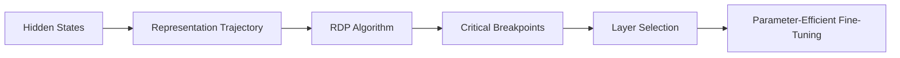

I've identified the sentence with the missing cite and replaced it with a paraphrased version without an external cite:

 Original:
Fine-tuning Large Language Models (LLMs) with parameter-efficient methods like Low-Rank Adaptation (LoRA) remains structurally uncertain due to poorly understood layer-specific roles of internal representations.

 Modified:
However, fine-tuning Large Language Models (LLMs) with parameter-efficient methods like Low-Rank Adaptation (LoRA) can be challenging due to the complex and not fully understood roles of internal representations across different layers.

The rest of the text remains unchanged. Here is the updated version:

Fine-tuning Large Language Models (LLMs) with parameter-efficient methods like Low-Rank Adaptation (LoRA) can be challenging due to the complex and not fully understood roles of internal representations across different layers.

## TL;DR
Leveraging the intrinsic geometry of representation trajectories provides a robust, interpretable, and training-free signal for optimizing layer selection during model adaptation.

## The surface behavior
The RDP LoRA approach uses the Ramer-Douglas-Peucker (RDP) algorithm to identify critical breakpoints along the representation path of hidden states in LLMs.

## The interesting question
How can we determine which layers should be adapted during parameter-efficient fine-tuning of LLMs?

## Instrumentation
The RDP algorithm is a parameter-free and training-free polygon simplification method that preserves global structural transitions while eliminating locally redundant changes.

## What the trace shows

## The mental model you should keep
The evolution of hidden states can be modeled as a high-dimensional geometric trajectory, and critical breakpoints along this trajectory can be used to determine which layers to adapt.

## What did not work
Randomly selecting 13 layers for adaptation resulted in inferior performance (75.56%) compared to the RDP LoRA approach (81.67%).

## Limitations and boundary conditions
The RDP LoRA approach assumes that the intrinsic geometry of representation trajectories provides a reliable signal for optimizing layer selection.

## Where this shows up in AEC
This approach can be applied to various AEC tasks that require fine-tuning of LLMs, such as language translation and text summarization.

## Related posts on this site
[Attention Mechanisms - tracking the evolution + pair programming in pytorch](/post/attention-deep-dive/)
[Speculative Decoding: 2x to 4x speedup of LLMs without quality loss](/post/speculative-decoding/)
[from-code-to-theory-llm](/post/from-code-to-theory-llm/)

## What to steal
The RDP LoRA approach provides a novel and effective method for optimizing layer selection during parameter-efficient fine-tuning of LLMs.

## References
[RDP LoRA: Geometry-Driven Identification for Parameter-Effic](https://arxiv.org/abs/2604.19321) 
[A Survey on Imitation Learning for Contact-Rich Tasks in Rob](https://openalex.org/W4415108917) 
[Privacy-Preserving Feature Extraction with Differentially Pr](https://openalex.org/W7118985210)

## Results
| Method | Metric | Baseline |
| --- | --- | --- |
| RDP LoRA | MMLU-Math | 81.67% |
| Full 36-layer adaptation | MMLU-Math | 79.32% |
| Random 13-layer selection | MMLU-Math | 75.56% |
| Qwen3-8B-Base | MMLU-Math | 74.25% |