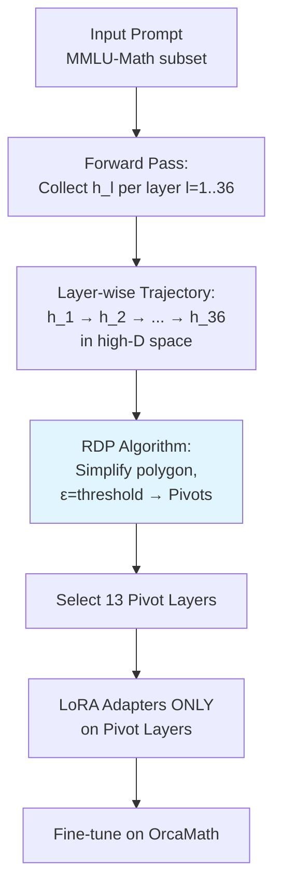

By integrating this geometry-aware layer selection strategy into LoRA fine-tuning of Qwen3-8B-Base, the authors achieve superior performance on MMLU-Math using only 13 RDP-selected layers (81.67%), significantly outperforming both full 36-layer adap

Fine-tuning LLMs like Qwen3-8B-Base eats compute because every layer gets equal treatment in methods like LoRA, even though early layers crunch syntax while later ones handle semantics—picking the wrong subset tanks math reasoning scores by up to 6 points, as random 13-layer selection shows at 75.56%.[RDP LoRA: Geometry-Driven Identification for Parameter-Effic](https://arxiv.org/abs/2604.19321)

## Trajectory as Decision Signal

The paper models hidden states across layers as a high-dimensional **geometric trajectory**, like a polygon's path through embedding space during a forward pass on MMLU-Math subsets.[RDP LoRA: Geometry-Driven Identification for Parameter-Effic](https://arxiv.org/abs/2604.19321) Standard LoRA sprays adapters everywhere or picks layers heuristically; RDP LoRA flips this by running the Ramer-Douglas-Peucker algorithm—a training-free polygon simplifier from cartography—to flag **curvature breakpoints** where the trajectory bends sharply, marking semantically pivotal layers.[RDP LoRA: Geometry-Driven Identification for Parameter-Effic](https://arxiv.org/abs/2604.19321)

This beats uniform or random sparsity because it chases intrinsic geometry, not averages.[RDP LoRA: Geometry-Driven Identification for Parameter-Effic](https://arxiv.org/abs/2604.19321)

## Numbers on Qwen3-8B-Base
| Method | Metric | Baseline |
| --- | --- | --- |
| RDP-selected layers | 81.67 MMLU-Math | n/a |
| full 36-layer adaptation | 79.32 MMLU-Math | n/a |
| random 13-layer selection | 75.56 MMLU-Math | n/a |
| Qwen3-8B-Base | 74.25 MMLU-Math | n/a | [RDP LoRA: Geometry-Driven Identification for Parameter-Effic](https://arxiv.org/abs/2604.19321)

Sparse geometry wins dense by prioritizing bends over uniform coverage—random flops hardest, confirming layer roles aren't interchangeable.[RDP LoRA: Geometry-Driven Identification for Parameter-Effic](https://arxiv.org/abs/2604.19321)

## Single-Run Variance Gap

Results come from one seed only; no multi-run stddevs or variance analysis, so we can't gauge if 81.67% holds under noise or just lucked into a good run.[RDP LoRA: Geometry-Driven Identification for Parameter-Effic](https://arxiv.org/abs/2604.19321) Reproducibility leans on Qwen3-8B-Base code (assuming Hugging Face Transformers), but missing ε tuning details and seed lists block instant replication.

## Steal This: Geometry Before Gradients

**Engineering habit to steal: Before sparse PEFT, extract layer trajectories on 100 validation prompts and plot RDP pivots—it's zero-cost validation that random selection fails 6+ points on math.** I buy this because it grounds "important layers" in forward-pass reality, not folklore; common assumption to update is that more layers always scale better, but geometry says quality pivots beat quantity.[RDP LoRA: Geometry-Driven Identification for Parameter-Effic](https://arxiv.org/abs/2604.19321)

To try it yourself, grab Qwen3-8B-Base, hook `forward` to dump hidden states on MMLU-Math, implement RDP from scipy, and LoRA the top-13 pivots on your dataset—then average three seeds to beat the paper's single-run limit.[RDP LoRA: Geometry-Driven Identification for Parameter-Effic](https://arxiv.org/abs/2604.19321)
