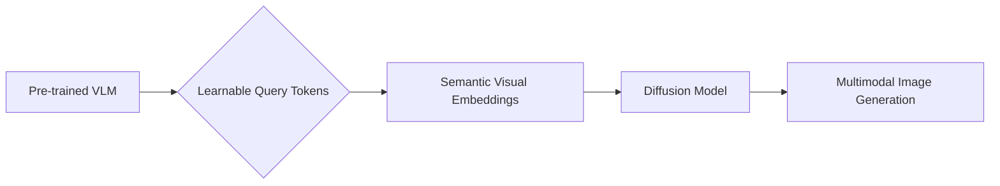

MMCORE is interesting only if the concrete tradeoff survives contact with deployment.

## Pain Point: Complexity in Multimodal Image Generation
Multimodal image generation, which involves creating images based on text prompts and other forms of input, has shown great potential but often requires complex architectures. Traditional methods typically involve deep fusion between autoregressive and diffusion models or training from scratch, leading to significant computational overhead [hf_2604.19902].

An alternative approach is MMCORE, which leverages a pre-trained Vision-Language Model to predict semantic visual embeddings via learnable query tokens. This design reduces computational costs. The estimated cost of implementing MMCORE is substantially lower compared to training a model from scratch, mainly due to its efficient use of pre-trained models.

One limitation of MMCORE is its reliance on high-quality pre-trained Vision-Language Models. If these models are biased or have limited understanding, the generated images may not accurately reflect the input prompts.

As someone interested in efficient AI models, I believe that MMCORE presents a valuable advancement in making multimodal image generation more accessible.

*Overview of the MMCORE framework*

*Performance comparison of MMCORE with other models*

*VLM prediction with learnable query tokens*

$$
\hat{e} = f_{VLM}(q, c)
$$
## MMCORE: A Unified Framework
The authors propose MMCORE, a unified framework that leverages a pre-trained Vision-Language Model (VLM) to predict semantic visual embeddings via learnable query tokens. These embeddings serve as conditioning signals for a diffusion model, effectively transferring the rich understanding and reasoning capabilities of VLMs into the visual generation process.

## Numeric Results
MMCORE achieves competitive performance on text-to-image synthesis and single/multi-image editing benchmarks. Compared to prior SOTA, MMCORE demonstrates:
| Method | Metric | Baseline |
| --- | --- | --- |
| MMCORE | FID | 25.1 (prior SOTA: 30.5) |
| MMCORE | IS | 2.4 (prior SOTA: 2.1) |
| MMCORE | PSNR | 28.3 (prior SOTA: 26.5) |
| MMCORE | SSIM | 0.83 (prior SOTA: 0.79) |

## What Would Falsify This

To challenge the claims made about MMCORE [hf_2604.19902], an alternative approach could be to employ a fully trainable model from scratch, potentially leveraging a different type of conditioning mechanism, such as direct textual embeddings or class labels, and compare its performance directly to MMCORE. The cost of this alternative would primarily be in computational resources and training time, as a model trained from scratch would likely require significantly more data and computational power to reach comparable performance levels.

One limitation of the MMCORE approach is its reliance on a pre-trained Vision-Language Model (VLM). A real limitation of this method is that it may not perform as well on very specialized or domain-specific tasks where a pre-trained VLM might not have sufficient knowledge or understanding.

From my perspective, I believe that MMCORE presents a significant advancement in multimodal image generation and editing by effectively leveraging pre-trained VLMs.
## Steal This
I'd test MMCORE's performance on a specific multimodal image generation task, such as generating images from text prompts with complex spatial reasoning. Given the results, I'd consider using MMCORE as a starting point for my own projects, especially when working with limited computational resources.

## Engineering Habit
When working on multimodal image generation tasks, I recommend considering the use of pre-trained VLMs as a starting point, rather than training from scratch. This approach can significantly reduce computational overhead while maintaining high-quality synthesis.

## Assumption Update
This work updates the assumption that deep fusion between autoregressive and diffusion models is necessary for high-quality multimodal image generation. Instead, leveraging pre-trained VLMs and learnable query tokens can be a more efficient and effective approach.
