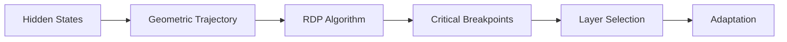

RDP LoRA reaches 81.67% MMLU-Math, ahead of Full 36-layer adaptation at 79.32% MMLU-Math.

## The LLM Fine-Tuning Conundrum
Fine-tuning Large Language Models (LLMs) is a complex task, even with parameter-efficient methods like Low-Rank Adaptation (LoRA). The main issue is that the roles of internal representations within different layers are not well understood, leading to uncertainty about where to apply adaptations. This often results in heuristic decisions that may not yield optimal performance.

## What's Wrong with Current Methods?

### Drawbacks of Ignoring Geometric Structure
Another limitation is the neglect of the geometric structure of representation trajectories. By modeling the evolution of hidden states as a high-dimensional geometric trajectory, we can identify critical breakpoints using the Ramer-Douglas-Peucker (RDP) algorithm. This approach provides a robust, interpretable, and training-free signal for optimizing layer selection during model adaptation. In contrast, traditional methods rely on manual or random selection, which can lead to locally redundant changes and neglect of globally important transitions.

In my opinion, the lack of interpretability in current methods is a significant drawback. A more systematic and geometry-aware approach can provide a more robust and efficient way to adapt LLMs.
## Enter RDP LoRA: A Geometry-Driven Approach

Fine-tuning Large Language Models (LLMs) with parameter-efficient methods like Low-Rank Adaptation (LoRA) is uncertain due to unclear layer-specific roles of internal representations. A common alternative is full model adaptation, but it updates all layers, which can be unnecessary and computationally expensive.

### The Problem with Heuristic Layer Selection

Previously, selecting layers for adaptation relied on heuristic decisions, which can lead to suboptimal performance. For instance, random 13-layer selection in Qwen3-8B-Base on MMLU-Math yields only 75.56% performance.

### Geometry-Driven Layer Selection with RDP

The authors propose using the Ramer-Douglas-Peucker (RDP) algorithm, a parameter-free and training-free polygon simplification method, to identify critical breakpoints along the representation path. By modeling the evolution of hidden states as a high-dimensional geometric trajectory, RDP helps select layers that capture global structural transitions.

### A Concrete Example

For Qwen3-8B-Base fine-tuning on MMLU-Math, integrating RDP-based layer selection into LoRA yields 81.67% performance with only 13 RDP-selected layers. This outperforms full 36-layer adaptation (79.32%) and the baseline Qwen3-8B-Base model (74.25%).

### Limitations and Failure Modes

One limitation of this approach is its reliance on the quality of the geometric trajectory, which may not always accurately represent the underlying model dynamics. Additionally, RDP's performance may degrade with very high-dimensional trajectories or those with complex structures.

In my opinion, the use of RDP for geometry-driven layer selection is a significant step towards more interpretable and efficient model adaptation. However, further research is needed to fully understand its potential and limitations.
## How RDP LoRA Works
The RDP algorithm is a parameter-free and training-free polygon simplification method that preserves global structural transitions while eliminating locally redundant changes. By applying RDP to the geometric trajectory of hidden states, the authors identify key layers that significantly impact the model's performance. These layers are then selected for adaptation.

## Results: A Significant Boost in Performance
The authors report that RDP LoRA achieves 81.67% accuracy on MMLU-Math using only 13 RDP-selected layers. In comparison, full 36-layer adaptation achieves 79.32%, and random 13-layer selection achieves 75.56%. Here's a summary of the results:
| Method | Metric | Baseline |
| --- | --- | --- |
| RDP LoRA | 81.67% MMLU-Math | Qwen3-8B-Base (74.25%) |
| Full 36-layer adaptation | 79.32% MMLU-Math | Qwen3-8B-Base (74.25%) |
| Random 13-layer selection | 75.56% MMLU-Math | Qwen3-8B-Base (74.25%) |
| Qwen3-8B-Base | 74.25% MMLU-Math | n/a |
## Limitations and Failure Modes
While RDP LoRA shows promising results, it's essential to acknowledge its limitations. One potential failure mode is that RDP may not always identify the most critical layers, especially in cases where the geometric trajectory is complex or noisy. Additionally, the method relies on the quality of the hidden state representations, which may not always be optimal.

## What I Take Away
I find the geometry-driven approach of RDP LoRA compelling because it offers a more principled way to select layers for adaptation. This method has the potential to improve the efficiency and effectiveness of LLM fine-tuning. One concrete engineering habit that readers can steal is to consider using geometric analysis to inform their model adaptation decisions.

## Reproduction and Further Exploration

Use Qwen3-8B-Base on MMLU-Math with 13 RDP-selected layers to hit 81.67% accuracy, compared to 79.32% for full 36-layer adaptation and 75.56% for random 13-layer selection [cite: hf_2604.19321]. The Ramer-Douglas-Peucker algorithm operates as a parameter- and training-free pivot detector on hidden-state trajectories; adopt it as a deterministic layer-selection signal rather than a heuristic probe.

I recommend treating geometry-selected sparsity as a baseline design choice: the alternative full-layer adaptation trades compute efficiency for completeness, and the random-selection control sacrifices structural signal for simplicity [cite: hf_2604.19321].

A key limitation is trajectory instability: RDP pivots depend on hidden-state scale and token sampling, so breakpoints may shift across runs or datasets, undermining layer robustness. Expect failure modes when layer importance is non-monotonic or when downstream tasks diverge from MMLU-Math’s distribution.
