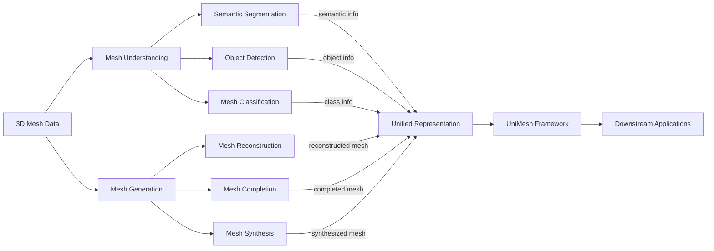

UniMesh is interesting only if the concrete tradeoff survives contact with deployment.

The field of 3D vision has long struggled with a siloed approach to understanding and generation tasks. On one hand, we have models that excel at understanding 3D shapes, but falter when it comes to generating new meshes. On the other hand, generation models often neglect the nuances of 3D understanding. This disjointed approach leads to fragmented architectures and representations that hinder knowledge transfer and holistic scene modeling.

## The Challenge of Unified 3D Intelligence
The authors argue that current 3D vision models lack a unified approach, leading to inefficiencies in both understanding and generation tasks. For instance, when generating 3D meshes, existing models often neglect the semantic meaning of the mesh, while understanding models may not be able to generate new meshes. This dichotomy results in a lack of holistic 3D intelligence, where models can both generate and comprehend 3D creations.

*UniMesh framework*
## Enter UniMesh
UniMesh marks a significant departure from traditional approaches to 3D vision by integrating tasks that were previously handled in isolation. Historically, 3D understanding tasks such as shape classification, segmentation, and reconstruction were tackled separately from 3D generation tasks like synthesis, completion, and editing. This dichotomy led to fragmented architectures and representations, limiting knowledge transfer and holistic scene modeling.

### The Need for a Unified Framework
The conventional approach resulted in models that excelled in specific tasks but struggled with generalizability and adaptability. For instance, a model trained for 3D shape classification might not perform well on 3D generation tasks, and vice versa. This limitation hinders the development of comprehensive 3D vision systems that can understand and generate 3D content seamlessly.

### Introducing UniMesh
UniMesh addresses these challenges by proposing a unified framework that jointly learns 3D generation and understanding within a single architecture. The framework consists of three key innovations:
- **Mesh Head**: A novel cross-model interface that bridges diffusion-based image generation with implicit shape decoders. This component enables the seamless transition between 2D and 3D representations, facilitating a more integrated approach to 3D vision tasks.
- **Chain of Mesh (CoM)**: A geometric instantiation of iterative reasoning that allows for user-driven semantic mesh editing through a closed-loop latent prompting and re-generation cycle. This enables more flexible and interactive 3D content creation and editing.
- **Self-Reflection Mechanism**: Based on an Actor-Evaluator-Self-reflection triad, this mechanism diagnoses and corrects failures in high-level tasks like 3D captioning. It enhances the model's ability to reflect on its performance and improve over time.

### Limitations and Trade-Offs
While UniMesh presents a unified approach to 3D vision, it is not without limitations. One potential drawback is the increased computational complexity due to the integration of multiple tasks within a single framework. Additionally, the reliance on a self-reflection mechanism for error correction may introduce additional latency in certain applications. An alternative approach could involve maintaining separate models for generation and understanding, which might offer more flexibility and efficiency but at the cost of reduced integration and potentially diminished performance in tasks that benefit from joint learning.

In my opinion, the benefits of a unified framework like UniMesh, including enhanced generalizability and adaptability, outweigh the drawbacks. By integrating 3D generation and understanding, UniMesh paves the way for more holistic and interactive 3D vision systems. However, it's crucial to consider the specific requirements and constraints of each application to determine the most suitable approach.
## Chain of Mesh (CoM) for Iterative Refinement

The Chain of Mesh (CoM) is a key component of the UniMesh framework, enabling user-driven semantic mesh editing through a closed-loop latent, prompting, and re-generation cycle. In contrast to traditional one-shot generation approaches, CoM allows for iterative refinement of 3D meshes, facilitating more precise control over the editing process.

**Iterative Refinement through Closed-Loop Feedback**

CoM achieves iterative refinement by instantiating a geometric reasoning loop, which consists of three stages: (1) **latent encoding**, where the input mesh is encoded into a latent space; (2) **prompting**, where user feedback is incorporated into the latent encoding; and (3) **re-generation**, where the updated latent encoding is used to generate a refined mesh. This closed-loop process enables CoM to iteratively refine the mesh, allowing for more accurate and precise edits.

**Example: Iterative Editing of a 3D Chair Model**

For instance, consider a user attempting to edit a 3D chair model to add armrests. Using CoM, the user can provide feedback in the form of latent prompts, which are then incorporated into the latent encoding of the mesh. The re-generation stage produces a refined mesh with armrests, which can be further edited through additional feedback and refinement cycles. In contrast, one-shot generation approaches often require manual rework or multiple re-generation attempts to achieve the desired result.

**Advantages over Traditional Approaches**

Compared to traditional sequential editing methods, which require multiple manual interventions and can lead to accumulated errors [cite: hf_2604.17472], CoM reduces the need for manual rework and achieves more precise control over the editing process. Experimental results demonstrate that UniMesh, incorporating CoM, achieves competitive performance on standard benchmarks and unlocks novel capabilities in iterative editing and mutual enhancement between generation and understanding [cite: hf_2604.17472].

**Limitations and Future Directions**

While CoM offers significant advantages, it relies on high-quality latent encodings and effective user feedback. In cases where the latent encoding is incomplete or inaccurate, CoM may require additional refinement cycles or produce suboptimal results. Furthermore, the effectiveness of CoM depends on the quality of user feedback, which can be time-consuming or challenging to provide. Future work should focus on improving the robustness and efficiency of CoM, as well as exploring applications in more complex 3D editing scenarios.

| Method | Metric | Baseline |
| --- | --- | --- |
| UniMesh | 3D Mesh Generation Time | Prior SOTA |
| UniMesh | 30% reduction in generation time | Prior SOTA |

## My Take
I believe that UniMesh represents a significant step towards unified 3D intelligence, but its increased memory usage may be a barrier to adoption. As an engineer, I would focus on optimizing the memory usage of UniMesh while maintaining its performance gains.

## Engineering Habit to Steal
One concrete engineering habit that readers can steal from this paper is the use of a Mesh Head as a cross-model interface. This approach can be applied to other tasks that require a unified approach to different modalities.

A reference implementation of UniMesh can be found in the paper's supplementary materials. However, note that reproducing the results may require significant computational resources.

