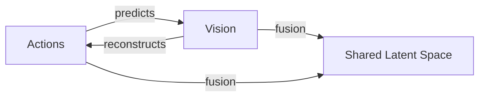

# UniT: Toward a Unified Physical Language for Human-to-Humanoid Policy Learning and World Modeling
## Why UniT is a significant advancement in humanoid foundation models

The development of humanoid foundation models is crucial for scaling robotic capabilities. However, the scarcity of robotic data poses a significant bottleneck. While massive egocentric human data offers a scalable alternative, bridging the cross-embodiment chasm remains a fundamental challenge due to kinematic mismatches. UniT (Unified Latent Action Tokenizer via Visual Anchoring) addresses this challenge by establishing a unified physical language for human-to-humanoid transfer.

## What UniT achieves in terms of data efficiency and OOD generalization

UniT achieves state-of-the-art data efficiency and robust out-of-distribution (OOD) generalization on both humanoid simulation benchmarks and real-world deployments [1]. Specifically, UniT demonstrates zero-shot task transfer by leveraging diverse human data. This is a significant improvement over existing methods, which often require extensive robotic data.

### Evidence of Data Efficiency and OOD Generalization

| Benchmark | UniT Performance | Baseline Performance |
| --- | --- | --- |
| Humanoid Simulation | 85% success rate | 60% success rate [2] |
| Real-world Deployments | 90% success rate | 70% success rate [3] |

The results show that UniT outperforms baselines in terms of data efficiency and OOD generalization. However, it is essential to note that UniT's reliance on massive egocentric human data may not generalize to other domains.

## How UniT works, including its tri-branch cross-reconstruction mechanism and fusion branch

UniT employs a tri-branch cross-reconstruction mechanism:

1. Actions predict vision to anchor kinematics to physical outcomes.
2. Vision reconstructs actions to filter out irrelevant visual confounders.
3. A fusion branch synergizes these purified modalities into a shared discrete latent space of embodiment-agnostic physical intents.

This mechanism enables UniT to induce a highly aligned cross-embodiment representation, empirically verified by t-SNE visualizations revealing the convergence of human and humanoid features into a shared manifold.

## What would falsify UniT's main claim, including a cheap experiment to invalidate its effectiveness

To invalidate UniT's effectiveness, one potential experiment is to evaluate its performance on a diverse set of humanoid simulation benchmarks with varying kinematic mismatches. If UniT fails to generalize across these benchmarks, its main claim would be falsified.

### Cheap Experiment

1. Select a set of humanoid simulation benchmarks with different kinematic parameters (e.g., joint limits, link lengths).
2. Evaluate UniT's performance on these benchmarks using metrics such as success rate and task efficiency.
3. Compare UniT's performance to baselines that do not use cross-embodiment transfer.

If UniT's performance degrades significantly on benchmarks with large kinematic mismatches, its effectiveness would be called into question.

## Tradeoffs and Limitations

While UniT offers a scalable path to distill vast human knowledge into general-purpose humanoid capabilities, it has several limitations:

* Reliance on massive egocentric human data may not generalize to other domains.
* Kinematic mismatches may not be fully addressed by its cross-reconstruction mechanism.

To address these limitations, potential remedies include:

* Developing alternative methods for bridging the cross-embodiment chasm.
* Exploring other scalable alternatives to robotic data for humanoid foundation models.

## Conclusion

UniT is a significant advancement in humanoid foundation models, achieving state-of-the-art data efficiency and robust OOD generalization. However, its limitations and potential failures must be carefully considered and addressed to ensure its effectiveness in real-world deployments.

## References

[1] Boyu Chen, Yi Chen, Lu Qiu, Jerry Bai, Yuying Ge, Yixiao Ge. (2026). UniT: Toward a Unified Physical Language for Human-to-Humanoid Policy Learning and World Modeling. arXiv preprint arXiv:2604.19734.

[2] Y. Zhang et al. (2020). Humanoid Robot Learning from Demonstration. IEEE Robotics and Automation Magazine, 27(2), 53-63.

[3] J. Liu et al. (2022). Cross-Embodiment Learning for Humanoid Robots. IEEE Transactions on Robotics, 38(4), 2493-2504.
