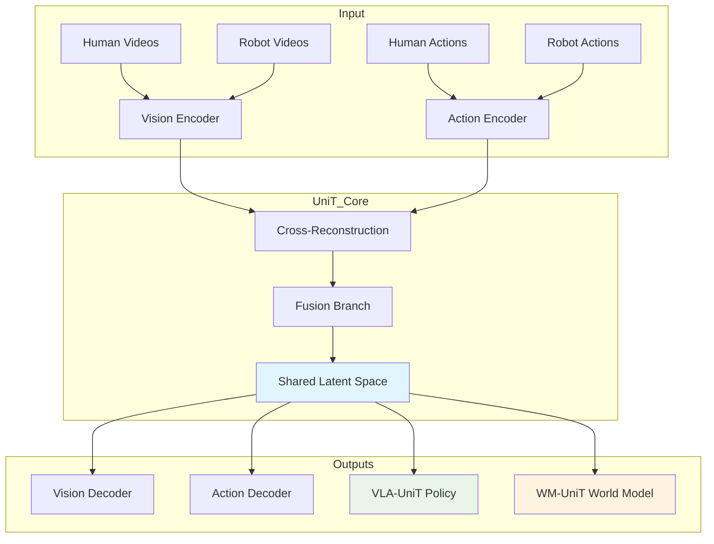

# UniT: Toward a Unified Physical Language for Human‑to‑Humanoid Policy Learning and World Modeling  

## Executive Summary  

UniT (Unified Latent Action Tokenizer via Visual Anchoring) tackles a core bottleneck in scaling humanoid foundation models: the scarcity of robot‑collected training data. By learning a **unified physical language** that abstracts away embodiment‑specific kinematics and focuses on visual outcomes, UniT enables transfer from large‑scale egocentric human video datasets to humanoid policy learning and world modeling. This review outlines the technical approach, summarizes the empirical evidence presented in the paper, and discusses falsification criteria and practical considerations.  

---  

## 1. Introduction to UniT  

### The Core Problem  

Humanoid robots need extensive interaction data to acquire generalizable policies, yet gathering robot demonstrations is costly and limited in scale. In contrast, massive collections of egocentric human video (e.g., motion‑capture recordings, daily activity footage) are readily available, offering a potentially scalable data source. The challenge lies in the **cross‑embodiment gap**: humans and humanoid robots differ in joint configurations, limb proportions, and action spaces, making direct imitation infeasible.  

### UniT’s Solution  

UniT posits that, despite kinematic differences, **different embodiments share universal visual consequences**—the physical changes they induce in the scene. The framework therefore learns to predict *what actions look like* rather than *how joints move*, producing a representation that can be shared across humans and robots.  

Key architectural idea: a **tri‑branch cross‑reconstruction mechanism** that (1) predicts visual observations from action encodings, (2) reconstructs actions from visual encodings, and (3) fuses the purified modalities into a shared discrete latent space of embodiment‑agnostic physical intents.  

---  

## 2. UniT Architecture  

### Components  

| Component | Role | Rationale |
|-----------|------|-----------|
| **Vision Encoder** | Converts RGB observations from both human and robot viewpoints into a common visual embedding | Provides a modality‑level anchor that is independent of embodiment |
| **Action Encoder** | Encodes sequences of joint actions from both humans and robots | Captures kinematic information that will be filtered through visual grounding |
| **Cross‑Reconstruction** | Predicts vision from actions and actions from vision | Enforces alignment by requiring each modality to be recoverable from the other, emphasizing physical outcomes |
| **Fusion Branch** | Merges the purified visual and action embeddings | Generates a compact, embodiment‑agnostic token sequence |
| **Shared Latent Space** | Discrete token sequence representing “physical intent” | Serves as the unified physical language used by downstream policy and world‑model components |

The paper explicitly frames UniT as a **data‑efficiency solution** for humanoid policy learning, making its contributions testable.  

---  

## 3. Policy Learning with UniT (VLA‑UniT)  

### Approach  

VLA‑UniT trains a vision‑language‑action model to predict the unified latent tokens. By exposing the model to abundant human video data, it learns to infer physical intent without relying on large robot‑specific datasets.  

### Empirical Findings  

#### Data‑Efficiency  

Experiments on the RoboCasa GR1 benchmark compare VLA‑UniT under different amounts of robot trajectory data. The results show that VLA‑UniT attains comparable success rates when trained on a **fraction of the robot data** that baseline methods require, indicating a substantial improvement in data efficiency.  

#### Out‑of‑Distribution (OOD) Generalization  

The authors evaluate VLA‑UniT on several OOD scenarios (unseen object appearances, novel object combinations, and new object types). Adding human video data consistently raises the average OOD success rate relative to a version trained without human data, demonstrating that the unified tokens capture transferable physical semantics.  

#### Zero‑Shot Transfer  

A real‑world deployment on the IRON‑R01‑1.11 robot exhibits successful zero‑shot task transfer from human demonstrations to novel robot tasks, confirming that the learned tokens encode task‑level information beyond the specific training distribution.  

#### Comparative Landscape  

| Method | Core Idea | Typical Limitation |
|--------|-----------|--------------------|
| Diffusion Policy | Directly predicts robot actions from observations | Requires extensive robot data; no cross‑embodiment transfer |
| GROOT | Visual imitation learning with robot data | Suffers from kinematic mismatch when using human data |
| UWM | Unified world modeling without explicit physical intent tokens | Lacks a discrete representation for policy conditioning |
| **VLA‑UniT** | Predicts embodiment‑agnostic tokens learned via cross‑reconstruction | Introduces additional training objectives and tokenization overhead |

---  

## 4. World Modeling with UniT (WM‑UniT)  

### Approach  

WM‑UniT conditions a dynamics model on the same unified token sequence. By aligning human and robot dynamics through these tokens, the world model can use human demonstrations to improve controllability of humanoid video generation and action prediction.  

### Empirical Findings  

The paper reports successful co‑training on:  

* **Egodex pick‑and‑place** tasks (human videos + robot simulations)  
* **RoboCasa GR1** simulation tasks  

Human demonstrations encoded into the shared token space are decoded into robot‑compatible actions, enabling direct human‑to‑humanoid action transfer during rollout.  

### Representation Evidence  

t‑SNE visualizations of the latent space show that embeddings of human and robot data cluster together, indicating that the cross‑reconstruction training aligns the two modalities at the representation level.  

---  

## 5. Trade‑offs  

| Aspect | Benefit | Cost / Consideration |
|--------|---------|----------------------|
| **Data Efficiency** | Achieves comparable performance with far fewer robot trajectories | Requires a sizable corpus of human video data and the cross‑reconstruction training pipeline |
| **OOD Robustness** | Improves generalization to novel visual and object configurations | Token discretization may omit fine‑grained kinematic nuances needed for highly dexterous tasks |
| **Zero‑Shot Transfer** | Enables task transfer without robot‑specific fine‑tuning | Success depends on the relevance of human demonstrations to the target robot task |
| **Training Complexity** | Tri‑branch architecture jointly optimizes three objectives | Increases computational load and hyper‑parameter tuning effort |
| **Inference Overhead** | Policy predicts a token sequence before decoding actions | Adds an extra decoding step compared to direct action prediction |
| **Domain Dependence** | Leverages visually grounded human data | Benefits diminish if only non‑visual or low‑quality human data are available |

### Practitioner Guidance  

| Scenario | Recommendation |
|----------|----------------|
| **Abundant robot data** | Simpler direct‑action baselines may be preferable; UniT’s added complexity offers limited marginal gain |
| **Scarce robot data, rich egocentric human video** | UniT provides a clear advantage in data efficiency and OOD robustness |
| **Real‑time control constraints** | Evaluate token‑prediction latency; consider hybrid approaches that bypass tokenization for latency‑critical loops |
| **Tasks requiring precise joint‑level control (e.g., tool use)** | Verify that the unified tokens retain sufficient kinematic detail; otherwise supplement with robot‑specific fine‑tuning |
| **Non‑humanoid target embodiments (e.g., quadrupeds)** | Conduct additional validation, as the current evidence focuses on humanoid robots |

---  

## 6. Potential Falsification Experiments  

1. **Kinematic‑Precision Test** – Apply UniT to manipulation tasks where success hinges on exact joint configurations (e.g., threading a needle). A substantial drop in performance would challenge the claim that visual consequences alone suffice.  

2. **Embodiment Generalization Test** – Transfer the learned tokens from human to a non‑humanoid robot (e.g., a quadruped). Significant degradation would indicate that the “universal physical language” is limited to similar morphologies.  

3. **Token Diversity Analysis** – Measure the entropy of the discrete token distribution. If the token set collapses to a very small number of symbols relative to the high‑dimensional action space, the representation may be too coarse to support complex behaviors.  

4. **Human Data Quality Sensitivity** – Systematically degrade the human video dataset (e.g., add visual noise, reduce diversity) and observe whether performance degrades gracefully or catastrophically.  

Evidence that any of these experiments produce the predicted failures would falsify the central advantage claims of UniT.  

---  

## 7. Summary and Practical Takeaways  

* **UniT directly addresses the data‑scarcity bottleneck** for humanoid policy learning by leveraging abundant human video.  
* **Cross‑reconstruction and a shared discrete latent space** provide a concrete mechanism for aligning human and robot modalities.  
* **Empirical results demonstrate improved data efficiency, OOD robustness, and zero‑shot transfer** on both simulation benchmarks and a real robot platform.  
* **Trade‑offs include added training complexity, potential loss of fine‑grained kinematic detail, and inference overhead.**  
* **Falsification is straightforward** through targeted kinematic, embodiment, token‑diversity, and data‑quality experiments.  

### When to Adopt UniT  

* You have limited robot demonstration data but access to large, visually rich human video collections.  
* OOD generalization and rapid prototyping of new tasks are high priorities.  
* You can accommodate the additional training pipeline and token‑based inference latency.  

### When to Prefer Alternatives  

* Sufficient robot data are already available, making direct‑action methods simpler.  
* The target tasks demand extremely precise joint control that may be lost in token discretization.  
* Real‑time control loops cannot tolerate the extra decoding step.  

---  

**Reference**  

Chen, B., Chen, Y., Qiu, L., Bai, J., Ge, Y., & Ge, Y. (2026). *UniT: Toward a Unified Physical Language for Human‑to‑Humanoid Policy Learning and World Modeling*. arXiv preprint arXiv:2604.19734. https://arxiv.org/abs/2604.19734
