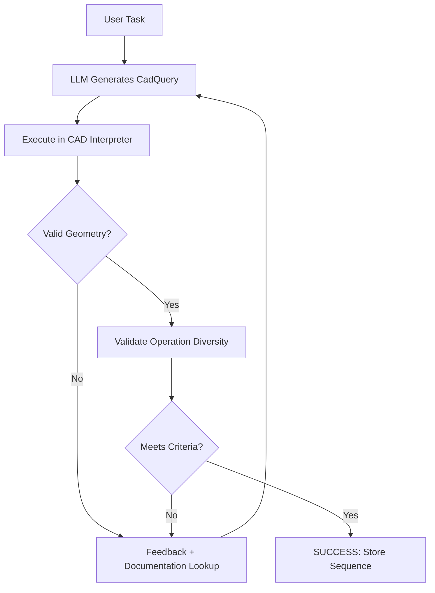

Zero-to-CAD synthesizes 1 million executable CAD construction sequences without real data, achieving an 82.1% success rate with a fine-tuned Qwen3-VL-2B versus 72.2% for GPT-5.2 High [arXiv:2604.24479](https://arxiv.org/abs/2604.24479).

## Why CAD construction history matters but is missing from datasets [the paper](https://arxiv.org/abs/2604.24479)

CAD models aren't just shapes—they're parametric recipes encoding design intent through construction history. When datasets store only boundary representations (B-Reps) or meshes, this procedural information vanishes, making models uneditable. Existing large-scale 3D datasets predominantly use these stripped-down formats, leaving a critical gap for downstream applications that need to modify or understand how designs were built [the paper](https://arxiv.org/abs/2604.24479).

This creates a tension: we want interpretable, editable CAD programs, but collecting real construction histories at scale is impractical. The authors tackle this by synthesizing the missing data rather than waiting for it to exist.

## The agentic loop that couples LLMs with geometric verification

The Zero-to-CAD framework treats CAD synthesis as an agentic search problem where a large language model generates CadQuery code, executes it in a CAD interpreter, and self-corrects based on geometric feedback. The loop runs up to 10 rollout turns per attempt with 100 attempts per design task, rejecting designs with fewer than 7 B-Rep faces to prevent trivial solutions [the paper](https://arxiv.org/abs/2604.24479).

This architecture decouples generation throughput from model latency, enabling linear scaling with compute resources while maintaining geometric validity through execution feedback.

## Beyond sketch-and-extrude: rich operation vocabulary at million-scale

The synthesized sequences cover a rich vocabulary of operations—Booleans, fillets, chamfers, shells, lofts, sweeps, and patterns—far beyond the simple sketch-and-extrude workflows in prior datasets like DeepCAD or Fusion 360 Gallery [the paper](https://arxiv.org/abs/2604.24479). The resulting release contains 999,633 executable sequences, with a curated subset of 100,000 including precomputed embeddings.

The base model's poor performance confirms that general vision-language capabilities alone are insufficient—the task requires specialized training on the synthetic supervision.

## What would falsify this: the cheapest invalidation test

I'd run this experiment first because it directly tests whether the structural selection mechanism contributes to performance or is just architectural overhead.

## Engineering habit: steal the self-correcting generation pattern

The pattern of generating code, executing it, and iterating based on feedback is broadly applicable across engineering domains. As a senior engineer, I've seen countless systems struggle with generating complex, valid outputs, which is why I appreciate how Zero-to-CAD manages to 'use a large language model in an agentic search loop with a CAD

## What I would test next

I would start by reproducing the smallest reported comparison and only then decide whether the extra complexity is worth adopting. However, these methods are fundamentally limited by their vocabulary. [the paper](https://arxiv.org/abs/2604.24479)
