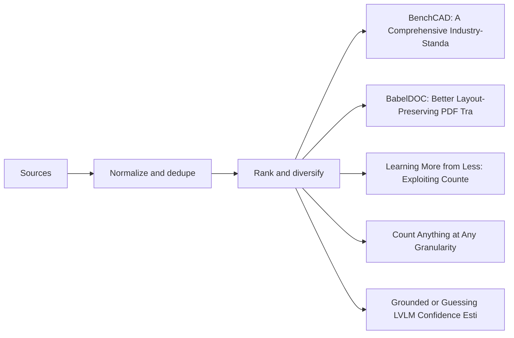

# Navigating the Future: AI's Blueprint for AEC and 2D Document Intelligence

The Architecture, Engineering, and Construction (AEC) industry stands at the precipice of a digital transformation, driven by the rapid evolution of Artificial Intelligence. As a Principal Machine Learning Engineer at Autodesk, my focus is on evaluating how cutting-edge research in multimodal AI can be leveraged to build robust foundation models for AEC and enhance 2D document intelligence. The sheer volume and complexity of data—from intricate CAD models to diverse 2D blueprints, specifications, and contracts—present unique challenges that demand sophisticated AI solutions. Recent advancements, particularly in areas like comprehensive benchmarking, layout-preserving document translation, granular information extraction, and the critical mitigation of model hallucination, are not just theoretical breakthroughs; they are paving the way for more reliable, efficient, and trustworthy AI systems essential for our strategic direction. This post delves into how these innovations are shaping our approach to AI in AEC, addressing the core challenges of evaluation, reliability, and efficiency that are paramount for real-world deployment.

## Bridging the Digital Divide: AI's Next Frontier in AEC and 2D Documents

The AEC sector, traditionally reliant on manual processes and fragmented data, is ripe for disruption through advanced AI. Our vision at Autodesk involves creating intelligent systems that can understand, interpret, and generate complex design and construction data, fundamentally transforming how projects are conceived, executed, and managed. This requires AI models that are not only powerful but also deeply integrated with the specific nuances of AEC workflows, from interpreting intricate 2D drawings to generating precise 3D models. The challenge lies in developing foundation models that can handle the multimodal nature of AEC data—combining visual, textual, and geometric information—while ensuring high levels of accuracy, reliability, and efficiency.

The research landscape is rapidly evolving to address these very challenges. We are seeing breakthroughs in how we evaluate the performance of AI in specialized domains like programmatic CAD, how we handle multilingual documentation without sacrificing critical layout, and how we extract granular insights from visual data. Crucially, there's a growing emphasis on making these powerful models more trustworthy by mitigating issues like hallucination and improving their ability to ground responses in visual evidence. Furthermore, the practical deployment of these large models demands significant engineering effort to optimize their efficiency. Each of these areas of research directly informs our strategy for building the next generation of AI-powered tools for the AEC industry, ensuring that our solutions are not only innovative but also robust, scalable, and truly impactful in real-world scenarios.

## BenchCAD: Defining Excellence in Programmatic Design

The promise of AI-driven programmatic Computer-Aided Design (CAD) is immense, offering the potential to automate complex design tasks and accelerate engineering workflows. However, realizing this vision requires models capable of generating executable parametric programs from various inputs, going beyond mere visual recognition to understand 3D structure, infer engineering parameters, and select appropriate CAD operations [E2](https://arxiv.org/abs/2605.10865). The critical problem has been the lack of a comprehensive, industry-standard benchmark to rigorously evaluate these capabilities in realistic industrial settings, making it difficult to gauge the true industrial readiness of multimodal large language models (MLLMs) for CAD automation.

Enter BenchCAD, a unified benchmark designed to address this gap [E2](https://arxiv.org/abs/2605.10865). Its core mechanism involves a dataset of multiple,multiple execution-verified CadQuery programs spanning multiple industrial part families, including complex components like bevel gears, compression springs, and twist drills [E2](https://arxiv.org/abs/2605.10865). BenchCAD evaluates models across multiple dimensions: visual question answering, code question answering, image-to-code generation, and instruction-guided code editing. This enables a fine-grained analysis of perception, parametric abstraction, and executable program synthesis, which are all crucial for industrial CAD applications [E1](https://arxiv.org/abs/2605.10865).

Experimental results across over ten frontier MLLMs reveal a significant limitation: while current systems can often recover coarse outer geometry, they frequently fail to produce faithful parametric CAD programs [E3](https://arxiv.org/abs/2605.10865). Common failures include missing fine 3D structures, misinterpreting industrial design parameters, and substituting essential operations like sweeps, lofts, or twist-extrudes with simpler sketch-and-extrude patterns [E3](https://arxiv.org/abs/2605.10865). Furthermore, while fine-tuning and reinforcement learning can improve in-distribution performance, generalization to unseen part families remains limited [E3](https://arxiv.org/abs/2605.10865). For AEC, BenchCAD is invaluable. It provides a crucial tool for measuring and improving the industrial readiness of multimodal CAD automation, guiding the development of foundation models that can truly understand and generate parametric designs, rather than just visual approximations. This directly impacts our ability to automate design iterations, ensure manufacturability, and integrate AI into core engineering processes, ultimately accelerating the design cycle and reducing errors.

## BabelDOC: Seamless Multilingual Document Workflows

In a globalized AEC industry, cross-lingual communication is a constant, and language barriers in visually rich documents like PDFs present a significant practical bottleneck. Existing document translation pipelines often face a tension: text-oriented Computer-Assisted Translation (CAT) systems discard crucial structural metadata, while document parsers focus on extraction without supporting faithful re-rendering after translation [E4](https://arxiv.org/abs/2605.10845). This problem can lead to critical errors in AEC documents where precise layout and formatting are as important as the content itself, potentially causing misinterpretations of architectural plans, structural specifications, or legal contracts.

BabelDOC addresses this by introducing an Intermediate Representation (IR)-based framework for layout-preserving PDF translation [E4](https://arxiv.org/abs/2605.10845). The core mechanism of BabelDOC is its ability to decouple visual layout metadata from the semantic content. This separation enables document-level translation operations such as terminology extraction, cross-page context handling, glossary-constrained generation, and formula placeholdering, which are vital for technical documents in AEC [E5](https://arxiv.org/abs/2605.10845). After translation, the content is meticulously re-anchored to the original layout using an adaptive typesetting engine, ensuring that the translated document retains its original visual integrity [E5](https://arxiv.org/abs/2605.10845).

Experiments conducted on a curated benchmark, involving both human evaluation and multimodal LLM-as-a-judge assessments, demonstrate BabelDOC's effectiveness. It significantly improves layout fidelity, visual aesthetics, and terminology consistency compared to representative baselines, all while maintaining competitive translation precision [E6](https://arxiv.org/abs/2605.10845). The framework's ability to preserve layout is particularly important for AEC documents, where the spatial arrangement of text, images, and diagrams conveys critical information. For Autodesk, BabelDOC is a game-changer. It ensures that critical documents like architectural plans, structural specifications, and legal contracts can be accurately translated across languages without losing their original formatting or introducing inconsistencies. This enhances global collaboration, reduces the risk of misinterpretation, and streamlines international project delivery, directly impacting our ability to manage multi-language project documentation effectively and efficiently.

## Extracting Granular Truths: From Data-Efficient Charts to Precise Object Counts

The ability to extract precise, granular information from visual documents is fundamental to intelligent document analysis in AEC. Recent research offers compelling solutions for two distinct, yet equally critical, challenges: understanding charts with limited data and counting objects at varying levels of detail within complex visual inputs. These capabilities are essential for automating tasks like data analysis from reports and quantity take-offs from blueprints.

For chart understanding, Vision-Language Models (VLMs) have shown promise, but often rely on large synthetic datasets, which can be inefficient and resource-intensive. A key limitation is that standard supervised fine-tuning (SFT) often treats training instances independently, failing to enforce "counterfactual sensitivity" – the ability to discern how small visual changes, often programmatically generated, drastically alter semantics and correct answers [E9](https://arxiv.org/abs/2605.10855). ChartCF, a data-efficient training framework, tackles this problem by enhancing counterfactual sensitivity [E9](https://arxiv.org/abs/2605.10855). Its mechanism involves three components: a counterfactual data synthesis pipeline that modifies code to generate varied chart examples, a chart similarity-based data selection strategy to filter overly difficult samples for improved training efficiency, and multimodal preference optimization across both textual and visual modalities [E7](https://arxiv.org/abs/2605.10855). Experiments across five benchmarks demonstrate that ChartCF achieves superior or comparable performance to strong chart-specific VLMs while utilizing significantly less training data [E8](https://arxiv.org/abs/2605.10855). This data efficiency is particularly valuable for AEC, where specialized chart types in reports or analyses might have limited annotated examples, allowing us to build robust models with less proprietary data and faster iteration cycles.

Complementing chart understanding is the challenge of open-world object counting, a task that is surprisingly brittle despite rapid advances in VLMs. Traditional methods often treat "what to count" as a single, category-level matching problem, leaving counting granularity implicit [E12](https://arxiv.org/abs/2605.10887). This leads to brittleness and severe prompt-following failures in both multimodal large language models and specialist counting models when fine-grained distinctions are required [E10](https://arxiv.org/abs/2605.10887). KubriCount redefines this as multi-grained counting, where users can specify target appearance via visual exemplars and semantic granularity across five explicit levels using fine-grained text, optionally with negative prompts [E12](https://arxiv.org/abs/2605.10887). To overcome the critical data bottleneck for such fine-grained distinctions, KubriCount introduces the first fully automatic data-scaling pipeline that integrates controllable 3D synthesis with consistent image editing and VLM-based filtering [E11](https://arxiv.org/abs/2605.10887). This pipeline was used to construct KubriCount, described as the largest and most comprehensively annotated counting dataset to date, supporting both training and multi-grained evaluation [E11](https://arxiv.org/abs/2605.10887). Motivated by these findings, HieraCount, a multi-grained counting model, was trained to jointly leverage text and visual exemplars as complementary target specifications, substantially improving multi-grained counting accuracy and generalizing robustly to challenging real-world scenarios [E10](https://arxiv.org/abs/2605.10887). For AEC, KubriCount and HieraCount have direct applications in automating quantity take-offs from blueprints, counting specific components in equipment layouts, or verifying the presence of safety symbols in construction plans, significantly enhancing accuracy and efficiency in detailed document analysis and compliance checks.

## Beyond Fluent Lies: Ensuring LVLM Reliability and Groundedness

The increasing reliance on Large Vision-Language Models (LVLMs) for interpreting complex AEC documents necessitates a critical focus on their reliability and trustworthiness. A significant problem is visual ungroundedness: LVLMs can produce fluent, confident, and even seemingly correct responses driven purely by language priors, with the image contributing little or nothing to the prediction [E15](https://arxiv.org/abs/2605.10893). Existing confidence estimation methods often fail to detect this, as they observe model behavior only under normal inference and lack a mechanism to determine if a prediction was truly shaped by the image or by text alone [E15](https://arxiv.org/abs/2605.10893). This poses a substantial risk in AEC, where factual accuracy based on visual evidence is paramount.

BICR (Blind-Image Contrastive Ranking) offers a solution by providing a model-agnostic confidence estimation framework that explicitly contrasts visually grounded and ungrounded responses during training [E15](https://arxiv.org/abs/2605.10893). Its mechanism involves extracting hidden states from a frozen LVLM twice: once with the actual image-question pair, and once with the image blacked out while the question remains fixed [E15](https://arxiv.org/abs/2605.10893). A lightweight probe is then trained on the real-image hidden state, regularized by a ranking loss that penalizes higher confidence on the blacked-out view. This teaches the model to interpret visual grounding as a signal of reliability, incurring zero additional inference cost [E13](https://arxiv.org/abs/2605.10893). Evaluated across five modern LVLMs and seven baselines on benchmarks including visual question answering, object hallucination detection, medical imaging, and financial document understanding, BICR achieved the best cross-LVLM average for both calibration and discrimination simultaneously, with statistically significant discrimination gains robust to cluster-aware analysis, and using significantly fewer parameters than the strongest probing baseline [E14](https://arxiv.org/abs/2605.10893).

Another critical challenge is hallucination, where LVLMs generate text that contradicts visual input. While recent studies often attribute these errors to inadequate visual attention [E18](https://arxiv.org/abs/2605.10622), HAVAE (Hijacking-Aware Visual Attention Enhancement) delves deeper, uncovering "Vocabulary Hijacking." This anomaly occurs when specific visual tokens, termed "Inert Tokens," disproportionately attract attention [E16](https://arxiv.org/abs/2605.10622). Crucially, when their intermediate hidden states are projected into the vocabulary space, these Inert Tokens consistently decode to a fixed set of unrelated words (termed "Hijacking Anchors") across layers, revealing a rigid semantic collapse [E16](https://arxiv.org/abs/2605.10622). HAVAE proposes Hijacking Anchor-Based Identification (HABI) to accurately localize these Inert Tokens and introduces the Non-Hijacked Visual Attention Ratio (NHAR), a novel metric designed to identify attention heads that remain resilient to hijacking and are critical for factual accuracy [E17](https://arxiv.org/abs/2605.10622). Building on these insights, HAVAE implements a training-free intervention that selectively strengthens the focus of these identified heads on salient visual content [E16](https://arxiv.org/abs/2605.10622). Extensive experiments across multiple benchmarks demonstrate that HAVAE significantly mitigates hallucinations without additional computational overhead, while preserving the model's general capabilities [E16](https://arxiv.org/abs/2605.10622).

For AEC, these advancements are paramount. BICR helps us understand when an LVLM is truly "seeing" the details in a blueprint versus merely "guessing" based on linguistic patterns, which is crucial for validating information extracted from complex drawings or specifications. HAVAE directly combats hallucination, preventing AI from generating factually incorrect or misleading information about designs, materials, or regulations—errors that could have severe consequences in construction and engineering. Together, they build a foundation for more trustworthy and reliable AI interpretation of AEC documents, which is a non-negotiable requirement for widespread adoption in our industry.

## ConQuR: Making Large Models Leaner for Production

The deployment of large language models (LLMs) in production environments is often hampered by their substantial memory footprint and high inference costs. While weight-activation quantization offers a path to reduce these costs, low-bit activation quantization remains challenging due to activation outliers that induce significant quantization error [E21](https://arxiv.org/abs/2605.10793). Existing rotation-based methods, which aim to redistribute activation magnitude across dimensions, either require expensive end-to-end rotation training or rely on storing large activation corpora, introducing significant compute or storage overhead. These limitations make it difficult to efficiently deploy powerful LLMs for real-time AEC applications.

ConQuR (Corner Aligned Activation Quantization via Optimized Rotations) addresses this by introducing a lightweight post-training rotation calibration method specifically for LLM activation quantization. The core mechanism involves learning orthogonal rotations that align normalized activations with the corners of an inscribed hypercube [E20](https://arxiv.org/abs/2605.10793). This objective encourages a more even distribution of activation energy across dimensions, which is crucial for effective quantization and minimizing error [E20](https://arxiv.org/abs/2605.10793). The beauty of ConQuR lies in its efficiency: this objective admits an efficient closed-form update via the orthogonal Procrustes problem, circumventing the need for gradient-based optimization over the orthogonal group [E20](https://arxiv.org/abs/2605.10793).

Furthermore, ConQuR incorporates an online calibration procedure that updates rotations as calibration samples are processed. This innovative approach eliminates the need to store activations on disk, which can be a significant storage burden, and allows rotations to adapt dynamically to quantized activation distributions during calibration [E20](https://arxiv.org/abs/2605.10793). Experiments on Llama-2 and Llama-3 models, ranging from 3B to 70B parameters, demonstrate that ConQuR achieves competitive or improved performance across perplexity benchmarks and common sense reasoning tasks [E19](https://arxiv.org/abs/2605.10793). Crucially, it does so while avoiding both costly end-to-end training and the storage of large offline activation datasets [E19](https://arxiv.org/abs/2605.10793). The practical benefits for AEC are substantial. Efficient deployment is a non-negotiable requirement for integrating large-scale foundation models into our workflows. ConQuR's ability to significantly reduce memory footprint and inference costs makes these powerful LLMs more feasible for real-world AEC applications, from intelligent search and summarization of vast document repositories to generative design assistance and automated code compliance checks, ultimately lowering the operational cost of AI-powered solutions and enabling broader adoption.

## Our Path Forward: From Research to Real-World AEC Impact

The research discussed here paints a compelling picture of how AI is evolving to meet the unique demands of the AEC industry and 2D document intelligence. Each advancement, from robust benchmarking to efficiency optimizations, contributes to a holistic strategy for building reliable and impactful AI solutions that can truly transform our workflows at Autodesk.

BenchCAD [E1](https://arxiv.org/abs/2605.10865) is foundational for our programmatic design initiatives. By providing a rigorous standard for evaluating CAD code generation, it directly informs the development of future AEC foundation models capable of generating truly parametric and manufacturable designs, moving us closer to intelligent automation in design and engineering. BabelDOC [E4](https://arxiv.org/abs/2605.10845) is critical for fostering global collaboration. Its layout-preserving, multilingual PDF translation capabilities ensure that international project teams can seamlessly share and understand complex documents, mitigating risks associated with misinterpretation and inconsistent terminology across diverse project stakeholders.

The innovations in granular information extraction, exemplified by ChartCF [E7](https://arxiv.org/abs/2605.10855) and KubriCount [E11](https://arxiv.org/abs/2605.10887), are set to revolutionize intelligent document analysis. ChartCF's data-efficient approach is invaluable for interpreting specialized data visualizations in AEC reports, allowing us to derive insights from limited proprietary datasets. Meanwhile, KubriCount's multi-grained object counting will automate precise quantity take-offs and component identification in drawings, significantly boosting efficiency and accuracy in project planning and execution, reducing manual effort and potential human error.

Perhaps most critically, the work on ensuring LVLM reliability and groundedness, through BICR [E15](https://arxiv.org/abs/2605.10893) and HAVAE [E16](https://arxiv.org/abs/2605.10622), is paramount for building trust in AI. These methods help us understand when models are truly grounded in visual evidence and actively mitigate hallucinations, preventing potentially catastrophic errors in interpreting complex AEC documents, where accuracy directly impacts safety and compliance. Finally, ConQuR [E19](https://arxiv.org/abs/2605.10793) addresses the engineering imperative of efficient deployment. By making large models leaner, it directly impacts the feasibility and scalability of integrating these powerful AI capabilities into our existing infrastructure, ensuring that advanced AEC foundation models and 2D document intelligence solutions are not only powerful but also practical and cost-effective for widespread adoption.

Our path forward involves a continuous cycle of evaluating such research, integrating proven techniques, and contributing to the open-source community where appropriate. The collective impact of these advancements will empower AEC professionals with intelligent tools that enhance productivity, improve decision-making, and ultimately shape a more resilient and sustainable built environment, reinforcing Autodesk's leadership in driving digital transformation across the industry.

## Visual map

## Visual diagnostics

