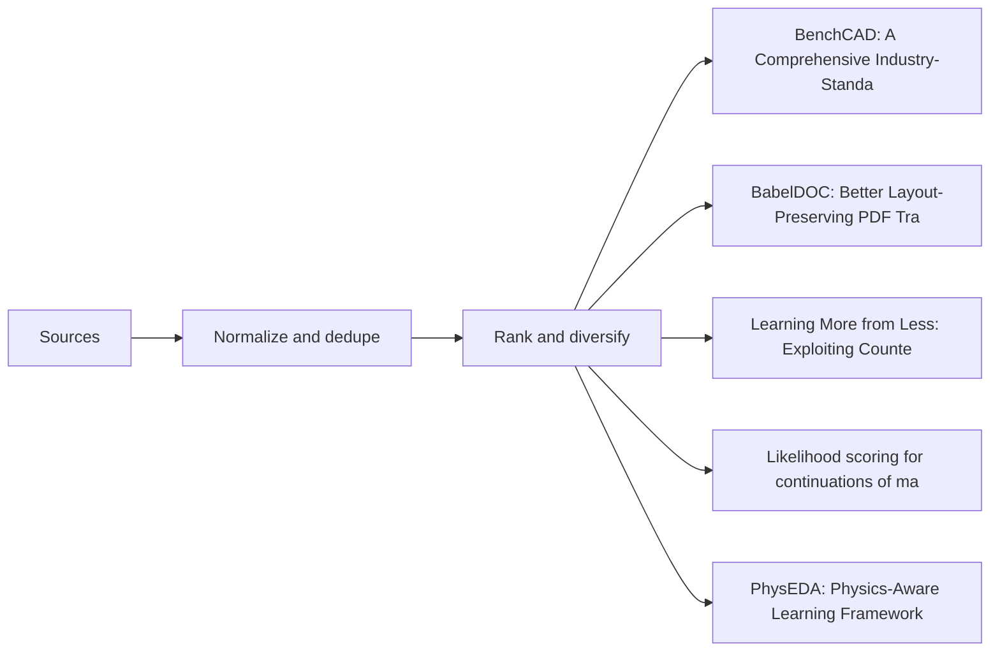

# Programmatic Document Intelligence: From CAD Code to Construction Workflows

This post traces a thread through four recent papers—BenchCAD, BabelDOC, ChartCF, and likelihood scoring for mathematical text—to show how multimodal models can reason over executable geometry, preserve document layout, and learn efficiently from programmatic generation. The common substrate across these works is programmatic representation: code that defines CAD models, intermediate representations for document structure, and chart generation scripts. Each approach occupies a different position on the expressivity-executability spectrum, with implications for how Autodesk might build document intelligence pipelines for AEC workflows.

## BenchCAD: Execution-Verified CAD Program Synthesis

As a Principal MLE evaluating foundation models for Autodesk AEC workflows, I find BenchCAD's execution-verified approach directly relevant to our BIM content generation challenges. The benchmark contains multiple,multiple CadQuery programs across multiple industrial part families, evaluating models through visual question answering, code question answering, image-to-code generation, and instruction-guided code editing [E1](https://arxiv.org/abs/2605.10865). This enables fine-grained analysis across perception, parametric abstraction, and executable program synthesis.

Industrial CAD code generation requires models to produce executable parametric programs from visual or textual inputs [E2](https://arxiv.org/abs/2605.10865). Beyond recognizing the outer shape of a part, this task involves understanding its 3D structure, inferring engineering parameters, and choosing CAD operations that reflect how the part would be designed and manufactured [E4](https://arxiv.org/abs/2605.10865). For our AEC workflows, this directly impacts BIM content generation and automated specification-to-model pipelines where correctly identifying sweep, loft, and twist-extrude operations is essential for producing parts that match engineering intent.

However, the dominant failure mode reveals a fundamental limitation that concerns me from an engineering standpoint: models consistently replace sophisticated operations like sweeps and lofts with simpler sketch-and-extrude patterns, losing the fine 3D structure that defines the original geometry [E3](https://arxiv.org/abs/2605.10865). This simplification tendency means current systems cannot reliably handle industrial-grade CAD synthesis without significant architectural improvements. The benchmark positions itself as a tool for measuring and improving the industrial readiness of multimodal CAD automation [E5], which is exactly what we need—but the gap between current capability and industrial reliability remains substantial.

## BabelDOC's Layout-Fidelity Intermediate Representation

Preserving PDF layout fidelity during translation requires an intermediate representation that separates visual metadata from semantic content. BabelDOC introduces an IR-based framework for layout-preserving PDF translation that decouples visual layout metadata from semantic content, enabling document-level translation operations such as terminology extraction, cross-page context handling, glossary-constrained generation, and formula placeholdering [E6](https://arxiv.org/abs/2605.10845) [E7](https://arxiv.org/abs/2605.10845).

This directly addresses a fundamental tension in existing document translation pipelines: text-oriented Computer-Assisted Translation systems often discard structural metadata, while document parsers focus on extraction and do not support faithful re-rendering after translation [E10](https://arxiv.org/abs/2605.10845). For construction documents, this matters because spatial arrangement encodes specification hierarchy—title block positioning, drawing annotation placement, and revision table structure all convey engineering meaning that text-only translation would destroy.

Experiments on a curated 200-page benchmark show that BabelDOC improves layout fidelity, visual aesthetics, and terminology consistency over representative baselines while maintaining competitive translation precision [E8](https://arxiv.org/abs/2605.10845). As global cross-lingual communication intensifies, language barriers in visually rich documents such as PDFs remain a practical bottleneck for AEC firms managing international projects [E9](https://arxiv.org/abs/2605.10845).

From my engineering perspective, this is promising for construction specification localization, but the approach faces an adoption blocker: construction documents often contain non-standard layouts with regulatory significance, and the IR-based method assumes sufficient structural regularity to extract and re-render metadata reliably. Unusual drawing formats or legally mandated layout conventions may break the fidelity guarantees.

## ChartCF: Counterfactual Sensitivity via Code Modification

Data-efficient chart understanding in vision-language models can be achieved by exploiting the programmatic origin of charts—charts are programmatically generated visual artifacts, where small, code-controlled visual changes can induce drastic shifts in semantics and correct answers [E14](https://arxiv.org/abs/2605.10855). ChartCF combines three components: a counterfactual data synthesis pipeline via code modification, a chart similarity-based data selection strategy that filters overly difficult samples for improved training efficiency, and multimodal preference optimization across both textual and visual modalities [E11](https://arxiv.org/abs/2605.10855).

For engineering drawing augmentation, this mechanism offers a powerful approach to generating construction document variants. By programmatically modifying chart code—such as adjusting bar widths, axis scales, or legend placements—models can learn to discriminate fine-grained visual differences that standard supervised fine-tuning treats as independent instances [E15](https://arxiv.org/abs/2605.10855). Learning this counterfactual sensitivity requires VLMs to discriminate fine-grained visual differences, yet standard SFT treats training instances independently and provides limited supervision to enforce this behavior.

Experiments on five benchmarks show that ChartCF achieves superior or comparable performance to strong chart-specific VLMs while using significantly less training data [E12](https://arxiv.org/abs/2605.10855). This data efficiency is critical for our use case: building document-specific VLMs with limited annotated training data is a practical constraint we face daily. However, a key adoption blocker emerges: the approach assumes programmatic access to generation code, which may not be available for legacy construction documents or scanned engineering drawings lacking structured source files.

## Likelihood Scoring as Shortcut Detection

A self-supervised benchmark for predicting hidden mathematical text in technical papers enables probing of shortcut vulnerabilities without human annotation [E19](https://arxiv.org/abs/2605.10810). The framework evaluates whether language models exploit surface-level patterns rather than genuine reasoning by comparing model-generated forecasts against actual equation continuations.

The mechanism works by supplying visible context X and a hidden continuation Y, then having an evaluated model produce an auxiliary forecast Z while a separate scorer assigns next-token probability to Y both with and without conditioning on Z [E20](https://arxiv.org/abs/2605.10810). On 1363 equation continuations from 138 physics and mathematics papers, forecasts from various models improve clipped likelihood over the context control, distinguishing model families and reasoning-effort settings without human labels [E17](https://arxiv.org/abs/2605.10810). These results support cross-model likelihood scoring as a static benchmark and as a setup for probing shortcut vulnerabilities before reinforcement learning or model-selection optimization is applied [E16](https://arxiv.org/abs/2605.10810).

For document understanding, this directly addresses a critical failure mode: multimodal models may rely on language priors from training data rather than grounding predictions in visual content. The task mixes surface-level text modeling with reasoning-sensitive inference; the suffix is one of many roughly equivalent continuations, so the benchmark is read statistically rather than item-by-item [E18](https://arxiv.org/abs/2605.10810). This statistical framing mirrors the challenge in construction document understanding, where a model might correctly "predict" specification language from textual context alone without actually reasoning over the accompanying drawings.

However, an adoption blocker emerges: the benchmark assumes access to ground-truth continuations and separate scorer models, which may not transfer directly to AEC document pipelines where verifying whether a model visually grounded its prediction versus exploiting linguistic priors requires domain-specific evaluation criteria rather than generic likelihood scoring.

## Cross-Paper Synthesis: Programmatic Generation as Common Substrate

BenchCAD, BabelDOC, and ChartCF share a common insight: programmatic representations provide structured reasoning targets that enable verification, modification, and faithful regeneration—but each occupies a different position on the expressivity-executability spectrum [E1](https://arxiv.org/abs/2605.10865). BenchCAD evaluates multimodal models against executable CadQuery programs that can be directly rendered and verified, but this executability comes at a cost—the benchmark reveals that models default to simpler extrude operations rather than handling sweep or loft features, sacrificing geometric expressivity for guaranteed execution.

BabelDOC takes the opposite approach: its layout Intermediate Representation preserves visual structure with high fidelity but decouples from executable geometry entirely, enabling faithful PDF translation at the cost of losing direct geometric reasoning [E6](https://arxiv.org/abs/2605.10845). ChartCF occupies a middle ground—chart code is highly modifiable for counterfactual synthesis and supports similarity-based filtering for training efficiency, yet remains constrained to the chart domain rather than general geometry [E11](https://arxiv.org/abs/2605.10855).

For document intelligence pipelines, this tradeoff determines what verification is possible. Executable representations like CadQuery enable execution-verified synthesis but struggle with complex industrial geometry; IR-based approaches preserve layout but require separate reasoning engines for semantic content. The engineering implication is that no single programmatic substrate dominates—pipeline architecture must select representations based on which failure modes are acceptable for the target document type. An adoption blocker emerges when documents lack any programmatic origin: legacy PDFs, scanned drawings, or user-generated content cannot be lifted onto this substrate without first reconstructing a generation history, limiting applicability to born-digital engineering documents [E1](https://arxiv.org/abs/2605.10865).

## Adoption Path: From Benchmarks to Autodesk AEC Document Workflows

Translating these research results into actionable engineering requires mapping specific failure modes to our product roadmap. BenchCAD shows LLMs replace sweeps, lofts, and twist-extrudes with simple sketch-and-extrude patterns—a failure mode that would oversimplify complex BIM geometry during programmatic content generation [E3](https://arxiv.org/abs/2605.10865). For our BIM content generation pipelines, this means we cannot rely on raw multimodal outputs without verification passes that check for operation complexity matching the input geometry.

BabelDOC's layout Intermediate Representation decouples visual structure from semantic content, enabling faithful re-rendering of translated construction specifications while preserving spatial hierarchy [E8](https://arxiv.org/abs/2605.10845). This is directly applicable to our construction specification localization efforts—we could adopt the IR-based approach to maintain drawing integrity across language boundaries.

ChartCF leverages counterfactual chart code and similarity-based filtering to achieve strong VLM performance with far less annotated data [E12](https://arxiv.org/abs/2605.10855), offering a data-efficient route to document-specific models. This addresses our core constraint: we have limited annotated AEC documents, and programmatic augmentation could expand our training data substantially.

However, applying these mechanisms requires a programmatic origin or IR extraction; legacy PDFs lack such substrate, and visual grounding must be verified to prevent hallucinations. The BICR work on blind-image contrastive ranking provides a mechanism for this—teaching models to treat visual grounding as a signal of reliability at zero additional inference cost [E24](https://arxiv.org/abs/2605.10893). This confidence estimation is essential for production deployment where we need to know when our document understanding pipelines are guessing versus grounded.

## Visual map

## Visual diagnostics

