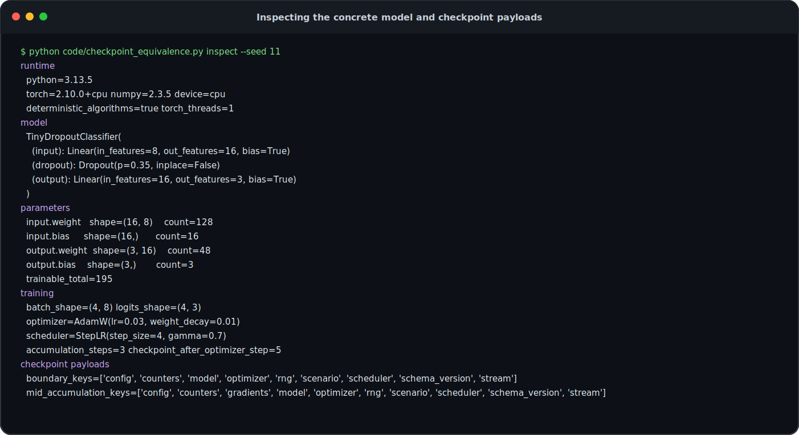
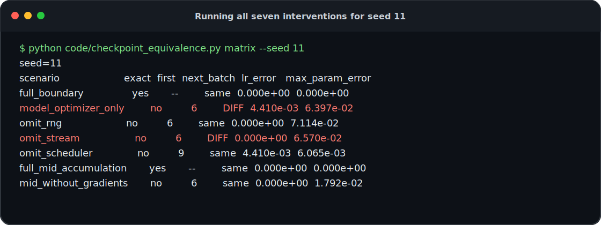
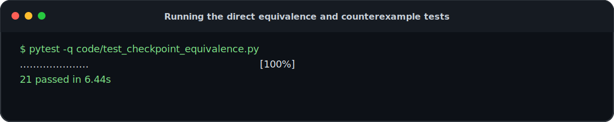
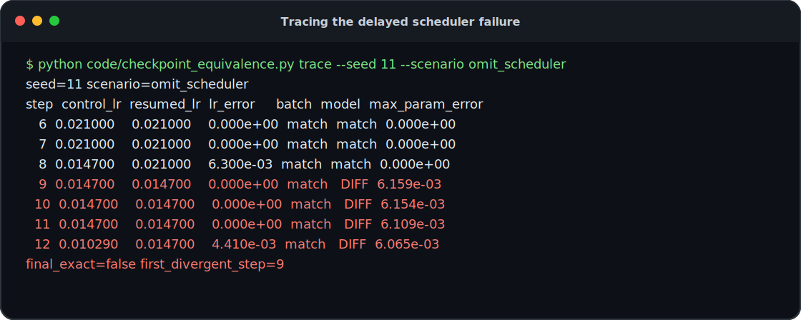
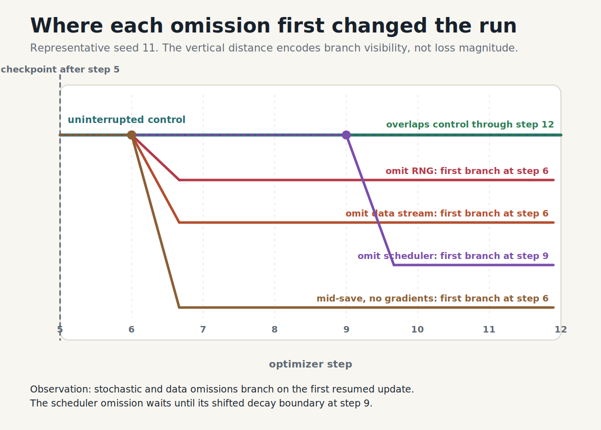
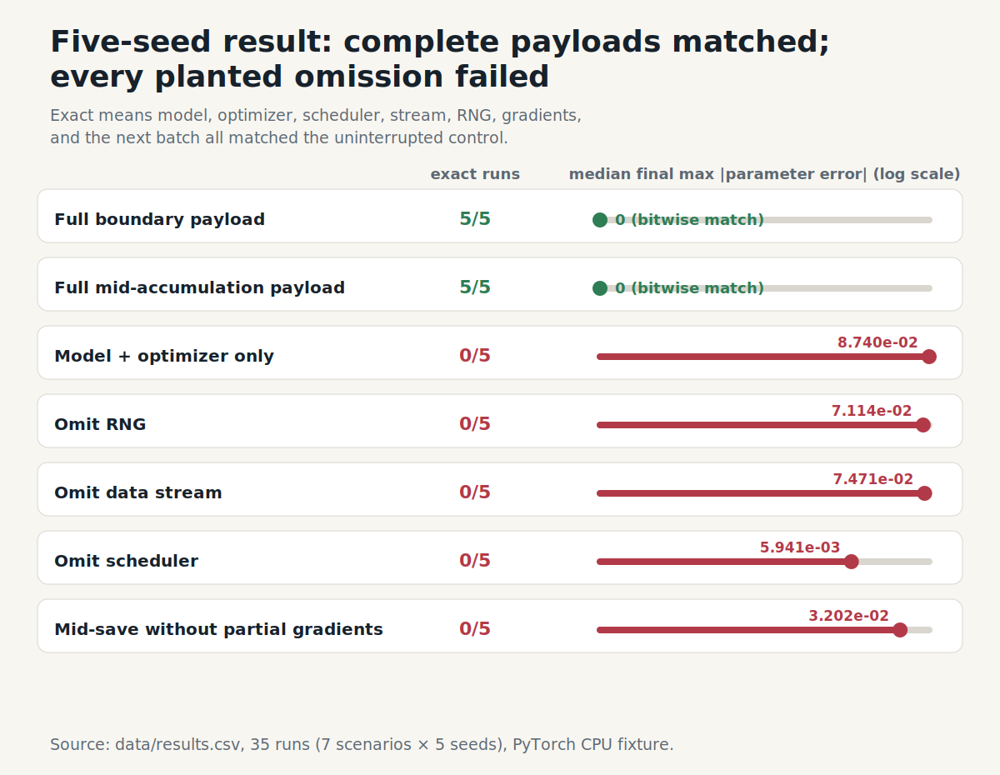
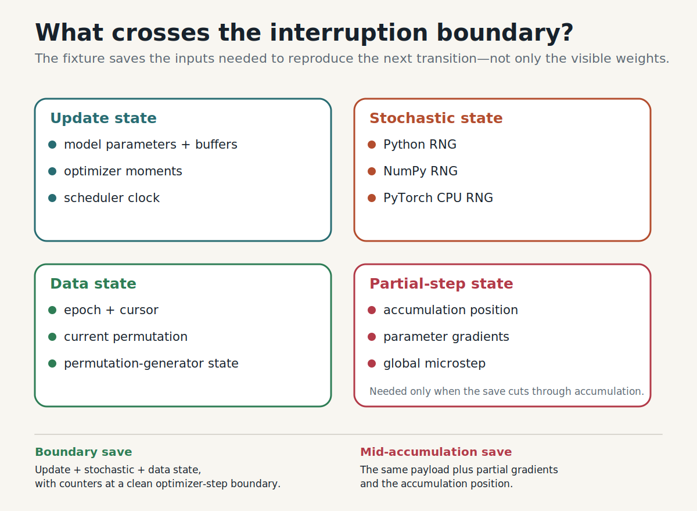

I wanted a checkpoint test that was harder to fool than “the file loaded”.

So I trained the same tiny dropout network two ways. The control ran for twelve optimizer steps without interruption. The resumed run stopped after step five, serialized a checkpoint, rebuilt the process, and finished the remaining seven steps.

Both paths used PyTorch 2.10.0 on CPU, AdamW, StepLR, three-way gradient accumulation, a shuffled data stream, and three independent sources of randomness: Python, NumPy, and PyTorch.

I expected “model plus optimizer” to get most of the way there. It did not.

Across seeds 11, 17, 29, 47, and 83, the complete checkpoint reproduced the uninterrupted run bit for bit. A model-plus-optimizer checkpoint branched on the first resumed update. Omitting only the scheduler looked fine for three updates, then changed the weights at step nine. Saving in the middle of gradient accumulation also failed if I discarded gradients that had already been computed.

That changed how I think about checkpoint tests. A successful load is useful, but it is not a resume test. The test I want asks: does the restored process produce the same next update as the uninterrupted control, then keep agreeing for a short future?

## The tiny training loop

The experiment is intentionally small enough to read end to end. This is the actual network used in every run:

```python
class TinyDropoutClassifier(nn.Module):
    def __init__(self, cfg: ExperimentConfig) -> None:
        super().__init__()
        self.input = nn.Linear(cfg.input_dim, cfg.hidden_dim)
        self.dropout = nn.Dropout(cfg.dropout_probability)
        self.output = nn.Linear(cfg.hidden_dim, cfg.num_classes)

    def forward(self, x: Tensor) -> Tensor:
        x = torch.tanh(self.input(x))
        x = self.dropout(x)
        return self.output(x)
```

It has 195 trainable parameters: an 8-to-16 linear layer, dropout at probability 0.35, and a 16-to-3 output layer. The dataset has 48 deterministic synthetic examples. A batch has four examples. Three microbatches contribute to each optimizer update.

The training path deliberately uses three independent stochastic sources. Python chooses a multiplicative scale. NumPy adds input noise. PyTorch samples the dropout mask. The batch stream separately owns the shuffled order and cursor:

```python
def run_one_microstep(job: TrainingJob) -> bool:
    x, y, ids = job.stream.next_batch()

    python_scale = 1.0 + (
        2.0 * random.random() - 1.0
    ) * job.cfg.python_scale_half_width
    numpy_noise = np.random.normal(
        loc=0.0,
        scale=job.cfg.numpy_noise_std,
        size=tuple(x.shape),
    ).astype(np.float32)
    augmented = x * python_scale + torch.from_numpy(numpy_noise)

    logits = job.model(augmented)
    raw_loss = F.cross_entropy(logits, y)
    (raw_loss / job.cfg.accumulation_steps).backward()

    job.microstep_in_accumulation += 1
    job.global_microstep += 1
    if job.microstep_in_accumulation == job.cfg.accumulation_steps:
        job.optimizer.step()
        job.scheduler.step()
        job.optimizer.zero_grad(set_to_none=True)
        job.optimizer_step += 1
        job.microstep_in_accumulation = 0
        return True
    return False
```

Before trusting any result, I made the script print the thing being tested: runtime, model, parameter shapes, optimizer, scheduler, and the keys present in boundary and mid-accumulation checkpoints.



*This is a rendered copy of [`data/terminal-01-fixture.txt`](data/terminal-01-fixture.txt), generated by the command shown in the first line.*

The full environment record is retained in [`data/environment.json`](data/environment.json): Python 3.13.5, PyTorch 2.10.0+cpu, NumPy 2.3.5, one PyTorch CPU thread, and deterministic algorithms enabled. PyTorch warns that complete reproducibility is not guaranteed across releases, platforms, or CPU and GPU execution, so the bitwise result in this article stops at this packaged CPU setup ([reproducibility notes](https://docs.pytorch.org/docs/stable/notes/randomness.html); [numerical accuracy notes](https://docs.pytorch.org/docs/stable/notes/numerical_accuracy.html)).

I wrote down three expectations before running the experiment:

1. A complete checkpoint saved at a clean optimizer-step boundary should match the uninterrupted control in this deterministic CPU setup.
2. Removing a component should cause divergence when that component first affects an update, not necessarily when the file is loaded.
3. A mid-accumulation save should need more than a boundary save, because unfinished gradient sums already contain work from earlier microbatches.

## Remove one field at a time

For each seed, the harness first builds an uninterrupted reference. Then it reconstructs the same job, stops it after optimizer step five or one microbatch into the next update, saves a selected checkpoint, creates a fresh process, restores the checkpoint, and compares the resumed path with the reference after every optimizer update.

The quickest way to see the design is to run all seven scenarios for one seed:

```bash
python code/checkpoint_equivalence.py matrix --seed 11
```

The seven scenarios are:

1. `full_boundary`: save at a clean optimizer-step boundary with model, optimizer, scheduler, RNG state, data-stream state, and counters.
2. `model_optimizer_only`: save only model weights and optimizer state; drop scheduler, RNG, stream, and clock/counter state.
3. `omit_rng`: keep the boundary checkpoint otherwise complete, but remove Python, NumPy, and PyTorch RNG state.
4. `omit_stream`: keep the boundary checkpoint otherwise complete, but remove the shuffled data-stream cursor/state.
5. `omit_scheduler`: keep the boundary checkpoint otherwise complete, but remove the learning-rate scheduler state.
6. `full_mid_accumulation`: save one microbatch into a three-microbatch accumulation window, including pending gradients.
7. `mid_without_gradients`: save at that same mid-accumulation point, but discard the already-computed gradients.



*The exact source transcript is [`data/terminal-02-seed-11-matrix.txt`](data/terminal-02-seed-11-matrix.txt). `first` is the first optimizer step whose model parameters differ from the uninterrupted control.*

Two rows match exactly: the complete boundary checkpoint and the complete mid-accumulation checkpoint. The five incomplete scenarios do not just end at different weights; they fail in different ways.

- `omit_rng` consumes the same next batch but changes the Python scale, NumPy noise, and dropout mask. It branches at step six.
- `omit_stream` changes the next batch itself and also branches at step six.
- `omit_scheduler` keeps the batch and early parameters aligned, then branches later.
- `mid_without_gradients` resumes from the correct model but has discarded work already accumulated into `.grad` tensors.
- `model_optimizer_only` combines several omissions, so it is a deliberately blunt negative control rather than evidence that every omitted field is independently necessary.

The test suite checks exact boundary recovery for all five seeds, exact mid-accumulation recovery for all five seeds, failure of every planted incomplete scenario, the delayed scheduler branch, the RNG-versus-stream distinction, and the terminal inspection commands used in this walkthrough.



*The retained output is [`data/terminal-04-tests.txt`](data/terminal-04-tests.txt). The suite reports 21 passed.*

## The scheduler failure was the interesting one

The comparator records model and optimizer tensors, scheduler state, stream state, RNG state, pending gradients, next-batch IDs, learning-rate error, and the first optimizer step with a parameter mismatch.

That extra detail matters because the most interesting failure did not show up on the first resumed update.

Here is the actual per-step trace for the seed-11 scheduler intervention:



*The source is [`data/terminal-03-scheduler-trace.txt`](data/terminal-03-scheduler-trace.txt). `control_lr` comes from the uninterrupted reference; `resumed_lr` comes from the process restored without scheduler state.*

The first two resumed updates match. At logical step eight, the control scheduler has decayed the learning rate to 0.014700 while the resumed scheduler still reports 0.021000. Yet the model remains identical at that instant.

The reason is ordering: the step-eight optimizer update already used the previously aligned learning rate, and `scheduler.step()` changed the rate only afterward. The wrong rate first affects the next optimizer update, so the parameter branch appears at step nine.

That sequence overturns a tempting diagnostic. A checkpoint can load, consume the expected batch, reproduce the first resumed loss, and still be wrong. The relevant clock may not affect computation until several updates later.

The pattern held across the full experiment:

| Scenario | Exact runs | First model branch | Median final max parameter error | Distinguishing signal |
|---|---:|---:|---:|---|
| Full boundary checkpoint | 5/5 | none | 0 | all compared components matched |
| Full mid-accumulation checkpoint | 5/5 | none | 0 | all compared components matched |
| Model + optimizer only | 0/5 | 6 | 8.740e-2 | next batch differs; LR later differs |
| Omit RNG | 0/5 | 6 | 7.114e-2 | next batch still matches |
| Omit data stream | 0/5 | 6 | 7.471e-2 | next batch differs |
| Omit scheduler | 0/5 | 9 | 5.941e-3 | batch still matches; LR branches first |
| Mid-save without partial gradients | 0/5 | 6 | 3.202e-2 | prior microbatch work is absent |



*Figure 1. The branch step is diagnostic: RNG and data-stream omissions fail immediately, while the scheduler omission changes learning rate first and model parameters one update later.*



*Figure 2. Complete checkpoints reproduced the control in every seed. Each deliberately incomplete checkpoint failed in every seed, but with different magnitudes and signatures.*

Both complete checkpoints produced 5/5 exact runs. Every deliberately incomplete scenario produced 0/5 exact runs. The 35 runs show that these signatures are not peculiar to one initialization. They do not estimate a universal error magnitude or prove behavior outside this software and hardware boundary.

## What belongs in this checkpoint

Only after seeing the branches is it useful to name the state that produced them. With code and static configuration fixed, one training update is:

\[
S_{t+1} = F(S_t),
\]

where the state used by this experiment is:

\[
S_t = (\theta_t, O_t, H_t, D_t, R_t, A_t).
\]

Here, \(\theta_t\) contains model parameters and buffers; \(O_t\) contains optimizer state; \(H_t\) contains the scheduler and training clock; \(D_t\) is the data stream; \(R_t\) is the collection of random-number generators; and \(A_t\) contains partial-update state such as accumulated gradients and the current microstep.

The resume test is about the resulting computation, not the fact that a file could be parsed:

\[
S^{\text{resumed}}_{t+k} = S^{\text{control}}_{t+k}
\quad \text{for the tested future steps } k.
\]

The checkpoint code exposes every selectable field:

```python
def save_checkpoint(job: TrainingJob, spec: ScenarioSpec) -> dict[str, Any]:
    payload = {
        "schema_version": 1,
        "scenario": spec.name,
        "config": asdict(job.cfg),
    }
    if spec.include_model:
        payload["model"] = copy.deepcopy(job.model.state_dict())
    if spec.include_optimizer:
        payload["optimizer"] = copy.deepcopy(job.optimizer.state_dict())
    if spec.include_scheduler:
        payload["scheduler"] = copy.deepcopy(job.scheduler.state_dict())
    if spec.include_rng:
        payload["rng"] = capture_rng_state()
    if spec.include_stream:
        payload["stream"] = copy.deepcopy(job.stream.state_dict())
    if spec.include_counters:
        payload["counters"] = {
            "optimizer_step": job.optimizer_step,
            "microstep_in_accumulation": job.microstep_in_accumulation,
            "global_microstep": job.global_microstep,
        }
    if spec.include_gradients:
        payload["gradients"] = capture_gradients(job.model)
    return payload
```



*Figure 3. The tested checkpoint surface spans update state, stochastic state, data-stream state, and partial-step state. The list is specific to this setup, not a universal checkpoint schema.*

The successful boundary checkpoint included model, optimizer, scheduler, three RNG snapshots, stream state, and counters. The interventions independently demonstrated that the scheduler, RNG, and stream can each change the resumed future. The combined `model_optimizer_only` intervention shows that weights and optimizer moments alone are insufficient, but it does not isolate the causal contribution of every jointly omitted field.

PyTorch's saving tutorial recommends a general training checkpoint rather than weights alone when training must continue, and the optimizer API documents that optimizer state includes per-parameter state and parameter-group configuration ([saving and loading tutorial](https://docs.pytorch.org/tutorials/beginner/saving_loading_models.html); [`Optimizer.state_dict`](https://docs.pytorch.org/docs/stable/generated/torch.optim.Optimizer.state_dict.html)). PyTorch exposes CPU RNG capture and restore through [`torch.get_rng_state()`](https://docs.pytorch.org/docs/stable/generated/torch.get_rng_state.html) and [`torch.set_rng_state()`](https://docs.pytorch.org/docs/stable/generated/torch.set_rng_state.html). The stateful data-loading tutorial uses the same `state_dict` and `load_state_dict` pattern for sampler and dataset progress ([StatefulDataLoader tutorial](https://meta-pytorch.org/data/0.9/stateful_dataloader_tutorial.html)).

Those APIs provide storage mechanisms. This experiment supplies the behavioral check: does the restored composition reproduce the next update and the short future that follows it?

## Mid-accumulation is a different promise

A clean optimizer boundary is special. `zero_grad()` has cleared pending gradients, and the accumulation counter is zero. One microbatch into a three-microbatch update, the model has not stepped, but each parameter's `.grad` tensor already contains part of the future update.

The complete mid-accumulation checkpoint saved the ordinary fields plus the pending gradients. It matched the uninterrupted control in 5/5 seeds. The paired test kept the same checkpoint position and omitted only those gradients. Its next optimizer update combined two resumed microbatches instead of the intended three, so it branched at step six in 0/5 exact runs.

That comparison directly establishes the role of pending gradients at this cut. The successful checkpoint also retained `microstep_in_accumulation` and `global_microstep`, because the loop must know whether the next backward pass completes an update, but those counters were not separately ablated in this experiment.

The choice is concrete. A system can promise **boundary-only recovery** and delay checkpoint completion until the current update commits. Or it can promise **arbitrary-point recovery** and serialize unfinished work, including gradients and, in mixed precision, scaler and overflow state.

What it cannot safely do is accept a mid-step preemption and restore the result as though every checkpoint represented a clean boundary.

## How I would use this as a release test

This two-layer CPU run is not a proxy for foundation-model training. Its value is the shape of the test: start both paths from the same known state, let one continue uninterrupted, interrupt and rebuild the other, feed them the same logical work, and compare at the earliest boundary where the changed component can matter.

For a deterministic single-process lane, require the next batch and clocks to match, compare model and optimizer tensors after the first resumed update, continue through at least one scheduler event, and retain omission controls that fail for the expected reason. That last condition matters. A comparator that cannot detect a deliberately missing RNG or stream cursor has not shown that its passing result is meaningful.

Distributed GPU training expands the comparison surface. Parameters and optimizer moments may be sharded; each rank can own distinct RNG and sampler state; workers may prefetch; pipeline stages can sit at different microsteps; and a topology change can require re-sharding. PyTorch Distributed Checkpoint supports distributed and sharded objects, including loading into a different topology, but successful storage and loading do not establish continuation equivalence for the surrounding training loop ([Distributed Checkpoint tutorial](https://docs.pytorch.org/tutorials/recipes/distributed_checkpoint_recipe.html); [DCP API](https://docs.pytorch.org/docs/stable/distributed.checkpoint.html)).

Exact equality may be the wrong threshold when kernels are nondeterministic or reduction order changes. In that case, preserve exact logical sample IDs, counters, schedules, and metadata; use exact tensor equality where the platform promises it; define bounded numerical error elsewhere; and reject a tolerance that compounds enough to change a downstream decision. These are engineering judgments to validate in the target topology, not conclusions proved by this CPU run.

On mismatch, retain both checkpoint files, the next-batch IDs, rank-local clocks, RNG hashes, learning rates, and per-step parameter deltas. The experiment was diagnosable because the first changed quantity was recorded. A production failure without that trace usually collapses into the unhelpful statement that “the resumed loss looked different.”

## What I changed my mind about

The complete boundary and complete mid-accumulation paths reproduced the uninterrupted control in every tested seed. The RNG and stream omissions branched immediately but left different fingerprints. The scheduler omission was more deceptive: its learning-rate clock became wrong before the model did. The mid-accumulation intervention showed that already-computed gradients are part of the recoverable computation when a save cuts through an update.

The package does not test CUDA RNGs, per-rank generators, DataLoader worker queues, mixed-precision scaler state, communication-library state, pipeline bubbles, FSDP optimizer re-sharding, or elastic world-size changes. It also does not establish that a numerically close GPU restart reaches the same downstream quality. Those remain separate experiments.

The changed decision is narrower and useful: do not approve a resume path because the checkpoint loads or because the first loss looks plausible. Approve it only after an interrupted path and an uninterrupted control agree on the next logical work and on the subsequent training transitions under an explicit tolerance. The next discriminating experiment is a two-rank setup with rank-local RNG and sampler state, followed by a topology-change case that separates correct re-sharding from correct continuation.

A restart becomes a resume only when the future agrees.

### References and executable evidence

1. PyTorch, [Saving and Loading Models](https://docs.pytorch.org/tutorials/beginner/saving_loading_models.html).
2. PyTorch, [Reproducibility](https://docs.pytorch.org/docs/stable/notes/randomness.html) and [Numerical Accuracy](https://docs.pytorch.org/docs/stable/notes/numerical_accuracy.html).
3. PyTorch, [`torch.get_rng_state`](https://docs.pytorch.org/docs/stable/generated/torch.get_rng_state.html), [`torch.set_rng_state`](https://docs.pytorch.org/docs/stable/generated/torch.set_rng_state.html), and [`torch.Generator`](https://docs.pytorch.org/docs/stable/generated/torch.Generator.html).
4. PyTorch, [`Optimizer.state_dict`](https://docs.pytorch.org/docs/stable/generated/torch.optim.Optimizer.state_dict.html), [`Optimizer.load_state_dict`](https://docs.pytorch.org/docs/stable/generated/torch.optim.Optimizer.load_state_dict.html), and [`LRScheduler`](https://docs.pytorch.org/docs/stable/generated/torch.optim.lr_scheduler.LRScheduler.html).
5. PyTorch, [Distributed Checkpoint tutorial](https://docs.pytorch.org/tutorials/recipes/distributed_checkpoint_recipe.html) and [Distributed Checkpoint API](https://docs.pytorch.org/docs/stable/distributed.checkpoint.html).
6. TorchData, [StatefulDataLoader tutorial](https://meta-pytorch.org/data/0.9/stateful_dataloader_tutorial.html).
7. Executable evidence: [`code/checkpoint_equivalence.py`](code/checkpoint_equivalence.py), [`code/test_checkpoint_equivalence.py`](code/test_checkpoint_equivalence.py), [`requirements.txt`](requirements.txt), [`data/results.csv`](data/results.csv), [`data/run-summary.json`](data/run-summary.json), [`data/raw-output.txt`](data/raw-output.txt), [`data/step-traces.json`](data/step-traces.json), [`data/environment.json`](data/environment.json), the four [`data/terminal-*.txt`](data/terminal-01-fixture.txt) transcripts, and [`asset-manifest.yaml`](asset-manifest.yaml).
