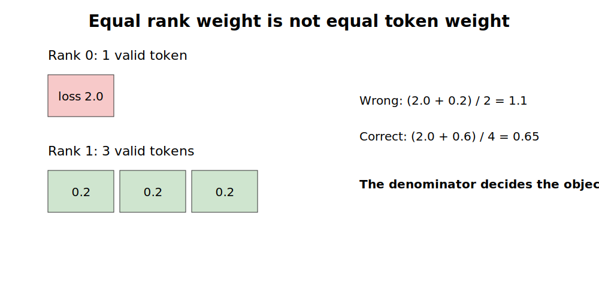
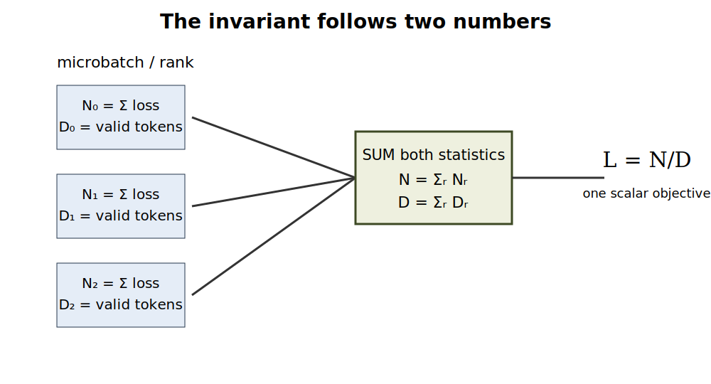
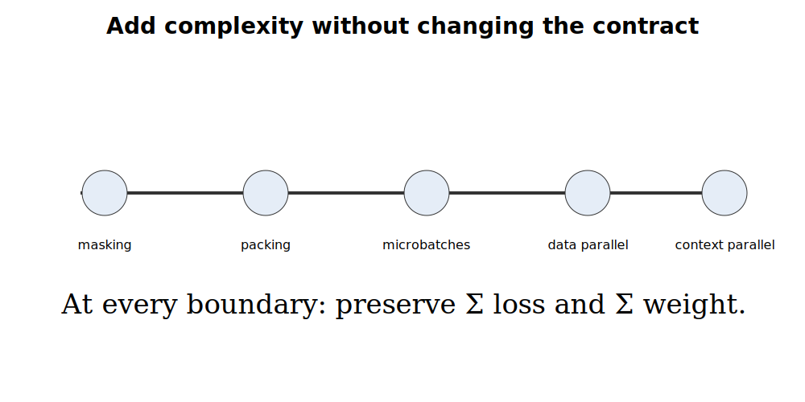

A rank with one valid token reports a mean loss of 2.0. Another rank has three valid tokens, each with loss 0.2. Averaging the two rank means gives 1.1.

That is not the mean token loss.

The four tokens carry losses $2.0, 0.2, 0.2, 0.2$, so the correct answer is

\[
\frac{2.0 + 0.2 + 0.2 + 0.2}{4} = 0.65.
\]

The error is not numerical noise. It is a different objective. Equal rank weight replaced equal token weight.



Everything in this article follows from one small fact: **a token-normalized loss needs two numbers, not one**.

## The irreducible mechanism

Let token $i$ have unreduced loss $\ell_i$ and non-negative training weight $m_i$. For ordinary masked language modeling, $m_i$ is 1 for a supervised token and 0 for an ignored token.

Define

\[
N = \sum_i m_i \ell_i,
\qquad
D = \sum_i m_i.
\]

The objective is

\[
L = \frac{N}{D},
\]

provided $D > 0$.

That is the complete mechanism:

1. sum weighted losses;
2. sum weights;
3. divide once, after both sums cover the same global batch.

Padding, sequence packing, gradient accumulation, and data parallelism may change where tokens live. They must not change which terms enter $N$ or $D$.

PyTorch's cross-entropy documentation states that ignored targets do not contribute and that mean reduction averages over non-ignored targets.[^pytorch-ce] That local behavior is correct. The system problem begins when several locally correct means are combined as though their denominators were equal.

## The smallest complete implementation

The implementation does not need a special distributed-loss class. It needs access to unreduced token losses and the valid-token mask. For language-model training, this usually means flattening batch and sequence positions before reduction, while keeping ignored targets at `-100`.

```python
import torch
import torch.nn.functional as F

losses = F.cross_entropy(
    logits,
    targets,
    reduction="none",
    ignore_index=-100,
)
valid = targets.ne(-100)

local_numerator = losses[valid].sum()
local_denominator = valid.sum().to(losses.dtype)
```

Across all data-parallel ranks, sum both values, then divide only if the global denominator is non-zero:

```python
global_numerator = local_numerator.clone()
global_denominator = local_denominator.clone()

torch.distributed.all_reduce(global_numerator, op=torch.distributed.ReduceOp.SUM)
torch.distributed.all_reduce(global_denominator, op=torch.distributed.ReduceOp.SUM)

if global_denominator.item() == 0:
    loss = global_numerator * 0.0
else:
    loss = global_numerator / global_denominator
```

The bundle's [minimal implementation](code/loss_reduction.py) uses the same rule without requiring a distributed launch. The tests simulate shards so the result can be compared against one concatenated global batch.



### Why not reduce the local mean?

A mean hides its denominator. Once a microbatch reports only $N_r / D_r$, the caller cannot recover the global mean unless it also knows $D_r$.

For ranks $r = 1, \ldots, R$, the correct objective is

\[
L
= \frac{\sum_r N_r}{\sum_r D_r}
= \frac{\sum_r \sum_{i \in r} m_i \ell_i}
       {\sum_r \sum_{i \in r} m_i}.
\]

The common shortcut

\[
\frac{1}{R}\sum_r \frac{N_r}{D_r}
\]

is equal only when all $D_r$ are identical, or by coincidence when local means align in a way that cancels the weighting error.

## The gradient must match too

Matching the scalar loss is necessary but not enough. A reduction can print the right value while producing the wrong gradient if scaling is introduced after backward or applied inconsistently across microbatches.

The strongest local test is simple:

1. split one logical batch into unequal shards;
2. compute the loss with the candidate reduction;
3. backpropagate;
4. concatenate the same tokens into one reference batch;
5. compute the ordinary token mean;
6. compare every gradient element.

The included test suite checks both loss and gradient equivalence:

```bash
cd code
pytest -q
```

The key assertion is

```python
assert torch.allclose(
    torch.cat([gradient_rank_0, gradient_rank_1]),
    global_reference_gradient,
    atol=1e-12,
)
```

This test is stronger than checking a training curve. It isolates the objective before optimizer state, data order, and stochastic kernels can hide the error. A loss reducer that cannot pass this local equivalence test should not be trusted in a distributed job.

## Add one complication at a time

The two-number contract survives each systems feature below.

### Ignored and padded tokens

Set $m_i = 0$. The token contributes to neither $N$ nor $D$.

A microbatch with no valid tokens has $N=0$ and $D=0$. It must not create a NaN. It should contribute zero to the global sums. Only the final global batch needs $D>0$.

### Sequence packing

Packing changes token layout and attention metadata. If the supervised token set is unchanged, the loss statistics are unchanged:

\[
N_{\text{packed}} = N_{\text{unpacked}},
\qquad
D_{\text{packed}} = D_{\text{unpacked}}.
\]

This gives a direct regression test for the previous curriculum topic: pack and unpack the same examples, then compare $N$, $D$, loss, and gradients.

### Gradient accumulation

Suppose an optimizer step contains microbatches $k=1,\ldots,K$. The step objective is

\[
L_{\text{step}} = \frac{\sum_k N_k}{\sum_k D_k}.
\]

Backward on each local mean $N_k/D_k$ and then divide gradients by $K$ is wrong when token counts differ. The equivalent per-microbatch contribution is

\[
\frac{N_k}{\sum_j D_j},
\]

not $N_k/D_k$. In practice, this means either knowing the step denominator before scaling each backward pass, or using an implementation that accumulates the numerator while preserving the same final gradient.

This is the next article's natural extension because automatic differentiation and optimizer boundaries add one subtlety: the denominator must be known when gradients are scaled.

### Data parallelism

PyTorch DistributedDataParallel synchronizes gradients across replicas; it does not infer the intended sample or token weighting from local losses.[^pytorch-ddp] The loss scaling before backward therefore remains part of the training objective.

The invariant is still global $N$ and global $D$. The implementation may use all-reduce, reduce-scatter, fused communication, or framework hooks. Those are transport choices, not objective choices.

### Context parallelism

Context parallelism partitions sequence activations across GPUs.[^nvidia-cp] If token losses are also partitioned, each context-parallel shard owns a partial numerator and denominator. Sum them across the group that collectively owns the logical tokens before treating the result as a data-parallel contribution.

The communication topology changes. The two statistics do not.



## A counterexample large enough to matter

The experiment script generates 100 eight-rank steps. Each rank receives between 1 and 64 valid tokens and an independent local mean loss. It compares:

- the token-weighted global loss;
- the unweighted mean of rank means.

Run it with:

```bash
python code/simulate_rank_imbalance.py
```

The generated data is in [simulation.csv](data/simulation.csv), with summary statistics in [simulation-summary.json](data/simulation-summary.json).

**Result produced by this article's experiment:** across 100 simulated eight-rank steps, the mean absolute error from averaging rank means is `0.1812`, and the worst observed absolute error is `0.6140`. This simulation is not a model-quality benchmark. It demonstrates that the algebraic error is ordinary, not an adversarial corner case.

The unit test contains the smallest counterexample; the simulation shows that variable denominators make the problem persistent.

## What the two numbers do not decide

The mechanism preserves a declared weighted-token objective. It does not decide what the weights should be.

These are different valid objectives:

- **token mean:** each valid token has equal weight;
- **example mean:** each example has equal total weight, regardless of length;
- **task-weighted mean:** tasks receive explicit contribution budgets;
- **domain-weighted mean:** domains receive explicit weights;
- **importance-weighted mean:** tokens or examples correct for a sampling distribution.

Each can still be represented as $N/D$. The weights $m_i$ encode the policy.

This distinction matters in multi-task SFT and post-training. A token-normalized objective lets long answers contribute more gradient mass than short answers. That may be intended. It may also silently overpower tasks with concise targets. The reducer cannot choose the policy; it can only preserve it exactly.

## Production-scale checks

The minimal mechanism creates a compact test contract:

1. **Token conservation:** the expected supervised tokens appear exactly once.
2. **Statistic conservation:** transformations preserve $N$ and $D$ when the objective is meant to remain unchanged.
3. **Gradient equivalence:** sharded execution matches a single logical batch.
4. **Zero-denominator safety:** empty local shards contribute zero without NaNs.
5. **Group correctness:** statistics are reduced across every dimension that partitions supervised tokens, and not across unrelated replicas twice.
6. **Metric transparency:** logs expose both loss and denominator. A scalar loss without its token count is incomplete operational evidence.

For observability, record at least:

- valid tokens per microbatch and rank;
- local and global $N$;
- local and global $D$;
- min/max rank token counts;
- coefficient of variation of rank token counts;
- fraction of zero-token shards;
- token-weighted training and validation loss.

These metrics make objective drift visible during changes to packing, sampling, dynamic batching, or parallelism.

## The irreducible core

The full rule fits in one line:

\[
\boxed{L = \frac{\text{global sum of weighted token losses}}
                 {\text{global sum of token weights}}}
\]

Everything else is bookkeeping and transport.

A system may reset positions, pack examples, split sequences, accumulate microbatches, shard optimizer state, or change the collective implementation. If it preserves the same numerator and denominator—and the resulting gradient—it preserves the objective.

That is the smallest complete mental model.

## Mastery check

1. Construct a three-rank example where the mean of local means overweights the shortest rank. Compute both answers by hand.
2. Extend [`loss_reduction.py`](code/loss_reduction.py) to support arbitrary floating-point token weights.
3. Add a test for example-normalized loss: each example should contribute equal total weight regardless of length.
4. Implement gradient accumulation over unequal-token microbatches and prove equivalence to one concatenated step.
5. Draw the reduction groups needed when sequence tokens are partitioned by context parallelism and examples are replicated by data parallelism.

Completion of the article marks these competencies as taught, not practiced or mastered. Practice requires running and explaining the exercises or an equivalent implementation.

## What this unlocks next

The immediate sequel is **gradient accumulation without objective drift**. After that, the same invariant supports:

- explicit task and domain weighting;
- dynamic microbatch sizing;
- context-parallel loss reduction;
- exact distributed evaluation;
- verifier and reward-model objectives with variable response lengths.

## Primary sources

[^pytorch-ce]: PyTorch, “CrossEntropyLoss,” official documentation, accessed 2026-07-17. The documentation defines `ignore_index` and mean reduction over non-ignored targets: <https://docs.pytorch.org/docs/stable/generated/torch.nn.CrossEntropyLoss.html>.
[^pytorch-ddp]: PyTorch, “DistributedDataParallel,” official documentation, accessed 2026-07-17: <https://docs.pytorch.org/docs/stable/generated/torch.nn.parallel.DistributedDataParallel.html>.
[^nvidia-cp]: NVIDIA, “Context Parallelism,” NeMo Framework User Guide, accessed 2026-07-17: <https://docs.nvidia.com/nemo-framework/user-guide/latest/longcontext/contextparallel.html>.

Additional implementation references are recorded in [`references.bib`](references.bib).
