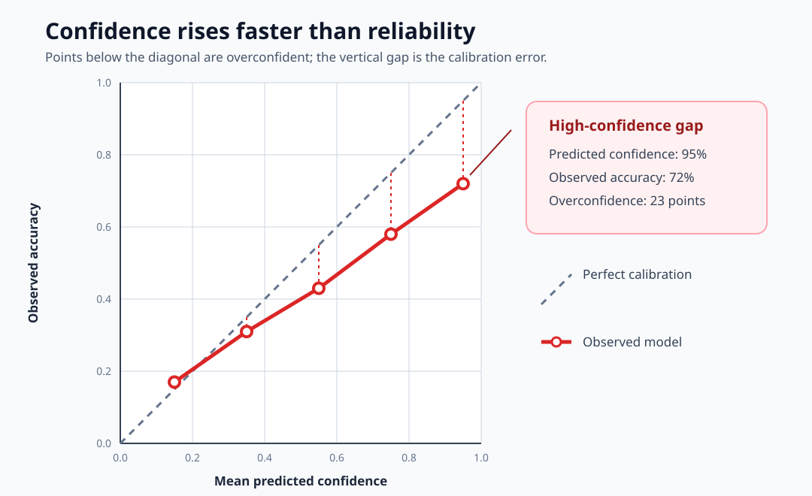
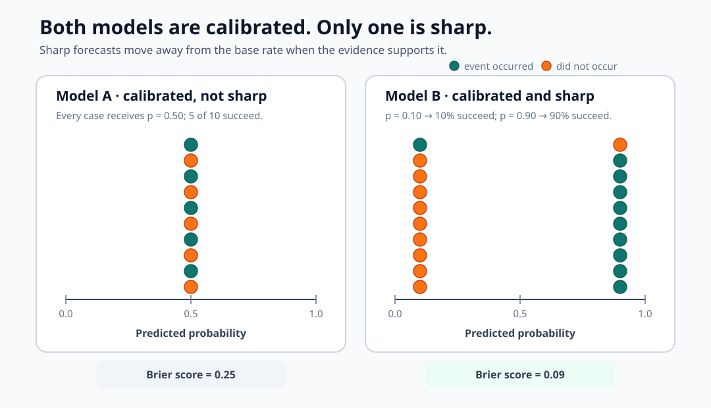
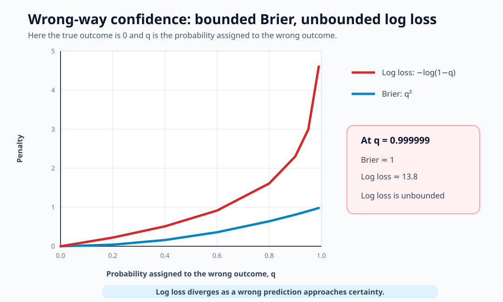
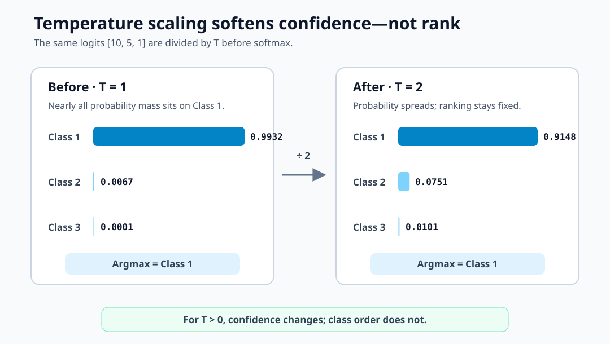
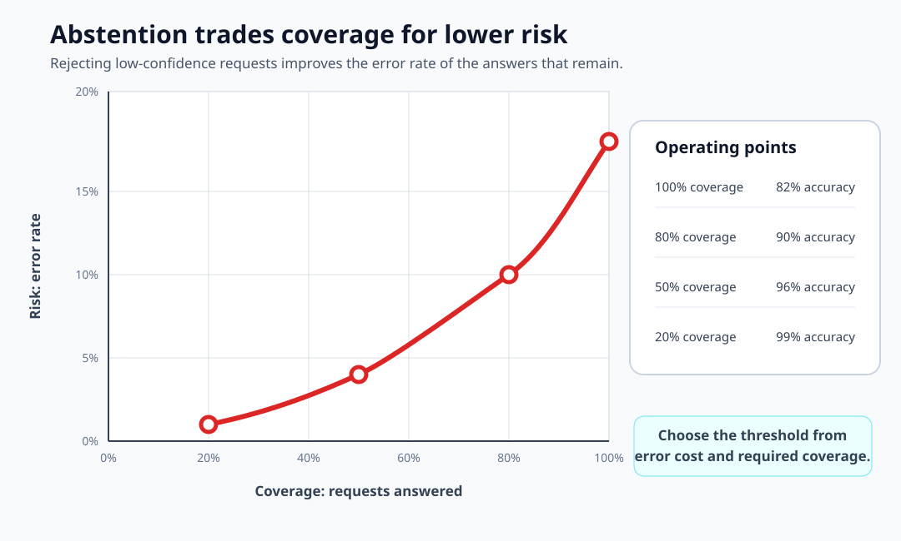
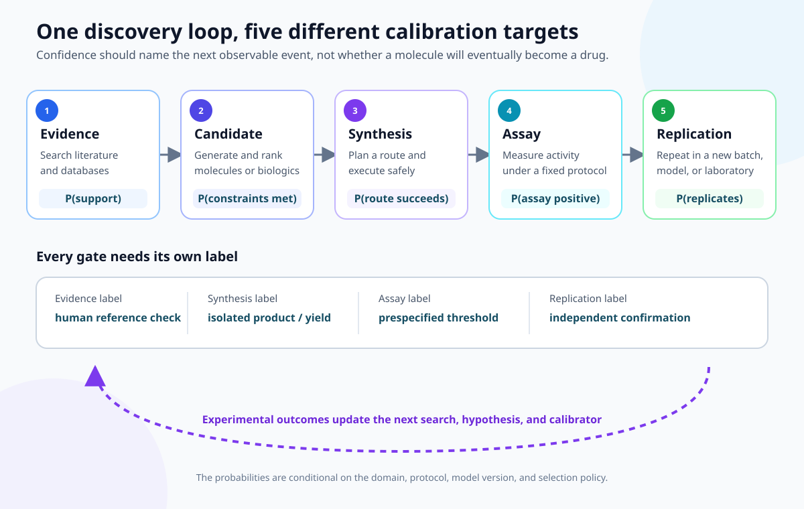
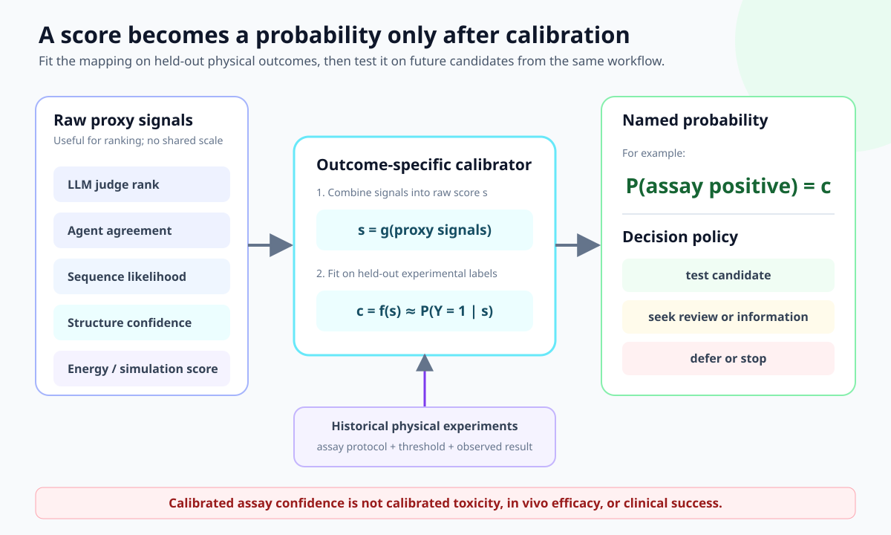
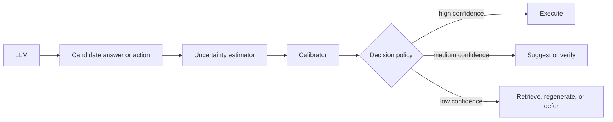

An LLM confidence score becomes useful only when a reported probability, say
80%, corresponds to an event that happens about 80% of the time.

## Accuracy vs calibration

The core idea behind model calibration is simple:

> When a model says "70% probability," the event should actually happen about
> 70% of the time.

It answers one question:

> Do predicted probabilities correspond to observed frequencies?

Accuracy counts how often the final decision is correct. Calibration asks whether
the probabilities attached to those decisions have the right numerical meaning.
A model can therefore be accurate while still assigning unjustified confidence.

That distinction becomes consequential when an LLM output drives a decision.
Here are a few illustrative cases:

| LLM-assisted case | If the system reports... | Calibration requires... |
|---|---|---|
| Chest X-ray interpretation | "75% probability that this image shows a pneumothorax" | Among comparable studies assigned 75%, the finding is confirmed by the reference standard about three times out of four. |
| Clinical decision support | "60% probability that the proposed diagnosis is correct" | About 60 of 100 comparable cases receive that diagnosis after the defined clinical work-up. |
| Drug discovery | "65% probability that this candidate crosses the activity threshold" | About 65 of 100 similarly scored candidates succeed under the same assay protocol. |
| Retrieval and citation | "90% probability that this source supports the generated claim" | Human review finds entailment in about 90 of 100 claims assigned that probability. |
| Tool-using software agent | "99.5% probability that this database migration preserves the required constraints" | Comparable migrations at that confidence fail about 5 times per 1,000 executions. |

These percentages are hypothetical. Each becomes meaningful only after the
event, reference standard, population, and operating conditions are specified.
In high-stakes settings such as medicine, calibrated confidence should support
triage and verification rather than replace clinical review.

Imagine a binary classifier predicts whether an object belongs in a room.

For 1,000 predictions where the model outputs approximately:

$$ P(y=1)=0.8 $$

If the model is perfectly calibrated, the object should truly belong in the room
in roughly 800 of those 1,000 cases.

A model can make every decision correctly while still being poorly calibrated.

Suppose two models make exactly the same classification decisions:

| Example | True label | Model A $P(Y=1)$ | Model B $P(Y=1)$ |
|---|---|---:|---:|
| 1 | 1 | 0.60 | 0.99 |
| 2 | 1 | 0.65 | 0.98 |
| 3 | 0 | 0.40 | 0.01 |
| 4 | 0 | 0.35 | 0.02 |

Both get 100% accuracy at threshold 0.5.

Model B assigns 0.98-0.99 probability to its chosen label on every example. If
it makes even occasional mistakes, those implied confidence levels are
unjustified.

Calibration asks:

$$ P(Y=1 \mid \hat P = p) = p $$

rather than simply asking whether $\arg\max \hat P = Y$.

## Reliability diagrams

The most intuitive calibration diagnostic is a **reliability diagram**.

A diagram can target any binary event. For a classifier or LLM confidence score,
let the event be "this prediction is correct." Then $\hat p_i$ is the confidence
assigned to the chosen label and $y_i$ records whether that choice was correct.

Take predictions and place them into confidence bins:

- 0-10%
- 10-20%
- ...
- 90-100%

For every bin $B_m$, calculate its mean predicted confidence:

$$
\operatorname{confidence}(B_m)
= \frac{1}{|B_m|}\sum_{i \in B_m}\hat{p}_i
$$

and its observed accuracy:

$$
\operatorname{accuracy}(B_m)
= \frac{1}{|B_m|}\sum_{i \in B_m} y_i
$$

Then plot mean predicted confidence on the x-axis against observed accuracy on
the y-axis. A perfectly calibrated model lies on the diagonal:

$$
y=x
$$

Consider these five bins:

| Mean confidence | Actual success rate |
|---:|---:|
| 0.15 | 0.17 |
| 0.35 | 0.31 |
| 0.55 | 0.43 |
| 0.75 | 0.58 |
| 0.95 | 0.72 |



The model is increasingly **overconfident** at high probabilities. In the last
bin, "95% sure" actually means "correct about 72% of the time." That 23-point gap
is a serious problem if a downstream system treats 0.95 as near-certainty.

## Expected calibration error

A reliability diagram shows *where* confidence and accuracy diverge. **Expected
calibration error (ECE)** compresses those gaps into one number.

For bins $B_1,\ldots,B_M$ containing $n$ predictions in total:

$$
\boxed{\operatorname{ECE}=\sum_{m=1}^{M}\frac{|B_m|}{n}\left|\operatorname{accuracy}(B_m)-\operatorname{confidence}(B_m)\right|}
$$

Each bin's absolute calibration gap is weighted by the fraction of predictions
that landed in that bin. Perfect calibration gives $\operatorname{ECE}=0$; larger
values indicate a greater mismatch between stated confidence and observed
accuracy.

### Example

Suppose three bins contain:

| Samples | Confidence | Actual accuracy |
|---:|---:|---:|
| 500 | 0.90 | 0.80 |
| 300 | 0.70 | 0.60 |
| 200 | 0.50 | 0.50 |

Then:

$$
\begin{aligned}
\operatorname{ECE}
&=0.5|0.8-0.9| \\
&\quad+0.3|0.6-0.7| \\
&\quad+0.2|0.5-0.5| \\
&=0.08
\end{aligned}
$$

So:

$$
\boxed{\operatorname{ECE}=8\%}
$$

Informally, the model's confidence is misaligned with empirical correctness by
about 8 percentage points under this binning.

## Limitations of ECE

ECE is useful, but it should not be treated as a definitive calibration score.
Its value depends substantially on how it is calculated.

### Number of bins

With 10 bins:

$$
[0,0.1), [0.1,0.2), \ldots
$$

a model might have $\operatorname{ECE}=0.03$. With 50 bins, the same predictions
might produce $\operatorname{ECE}=0.07$ because the finer partition exposes more
local calibration errors.

### Sample count

Small bins have noisy estimates. A bin containing 12 predictions might have mean
confidence:

$$
\hat p=0.8
$$

but only 7 successes:

$$
\operatorname{accuracy}=\frac{7}{12}\approx0.583
$$

That gap does not necessarily mean the model is dramatically miscalibrated. With
so few observations, sampling noise is large.

### Aggregation effects

Coarse grouping can hide local errors. Consider predictions with probabilities:

$$
0.51,\quad0.69
$$

that fall into the same broad bin with a mean of $0.60$. The bin as a whole might
appear calibrated even when the probability function is not.

ECE is useful for comparing model versions, but it is not a complete calibration
report. Its value changes with the number of bins and the binning strategy, and
large errors in sparse bins can disappear inside the weighted average. A useful
ECE report should therefore include:

- a reliability diagram
- the number of predictions in each bin
- equal-mass bins, which place similar numbers of predictions in each bin
- uncertainty intervals

## Brier score

The **Brier score** avoids binning entirely. For $N$ binary predictions:

$$
\boxed{
\operatorname{BS}
= \frac{1}{N}\sum_{i=1}^{N}(\hat p_i-y_i)^2
}
$$

where $y_i\in\{0,1\}$. It is simply mean squared error for probabilities.

### Example

Suppose the model predicts:

$$
[0.9,0.7,0.4,0.2]
$$

and the outcomes are:

$$
[1,1,0,0]
$$

The squared errors are:

$$
\begin{aligned}
(0.9-1)^2&=0.01,\qquad (0.7-1)^2=0.09, \\
(0.4-0)^2&=0.16,\qquad (0.2-0)^2=0.04.
\end{aligned}
$$

Therefore:

$$
\operatorname{BS}
= \frac{0.01+0.09+0.16+0.04}{4}
= 0.075
$$

Lower is better, and $\operatorname{BS}=0$ means perfect probabilistic prediction.

## Calibration and sharpness

A useful probabilistic model needs both **calibration** and **sharpness**.
Calibration means that predictions reported at 80% are correct about 80% of the
time. Sharpness means that the model moves probabilities away from the base rate,
the overall event frequency, when the evidence supports doing so. Predictions such as
$0.02,0.97,0.93$ are sharper than $0.49,0.53,0.51$.

ECE focuses on calibration. Brier score measures overall probabilistic quality,
so it rewards both calibration and sharpness.

Consider two calibrated models. Model A always predicts:

$$
P(y=1)=0.5
$$

Suppose the dataset really is 50% positive. Model A is calibrated, but it is not
useful for distinguishing positives from negatives.

Model B predicts 0.9 for many positives and 0.1 for many negatives, and those
probabilities match the observed frequencies. It is also calibrated, but much
more useful.

ECE could say:

$$
\operatorname{ECE}_A
\approx \operatorname{ECE}_B
\approx 0
$$

while Brier score strongly prefers Model B. Calibration alone is not enough.

The goal is:

$$
\boxed{\text{calibrated + sharp}}
$$

not merely calibrated. Brier score captures both requirements.



## Brier score decomposition

A single Brier score tells us whether the probabilities were good overall. Its
decomposition explains *why* the score is good or bad.

First define the event. For a correctness forecast, let $y_i=1$ when the answer
is correct and $y_i=0$ when it is wrong. For a drug-discovery forecast, the event
might instead be whether a candidate crosses a prespecified assay threshold.

Now divide the predictions into forecast groups $B_m$. Each group has:

- $n_m$: the number of predictions in the group;
- $\bar p_m$: the probability assigned to that group;
- $\bar y_m$: the observed event rate in that group;
- $\bar y$: the event rate across the entire dataset.

The group event rate is:

$$
\bar y_m=\frac{1}{n_m}\sum_{i\in B_m}y_i.
$$

It is an observed frequency, not another model prediction. If three of four
answers in a group are correct, then $\bar y_m=3/4=0.75$. When the event is
"the answer is correct," the event rate is simply the accuracy within that
group.

The Brier decomposition is:

$$
\boxed{\operatorname{BS}=\text{Reliability}-\text{Resolution}+\text{Uncertainty}}
$$

or, written in terms of the forecast groups:

$$
\begin{aligned}
\operatorname{BS}
&=\underbrace{\sum_m\frac{n_m}{N}(\bar p_m-\bar y_m)^2}_{\text{Reliability}} \\
&\quad-\underbrace{\sum_m\frac{n_m}{N}(\bar y_m-\bar y)^2}_{\text{Resolution}} \\
&\quad+\underbrace{\bar y(1-\bar y)}_{\text{Uncertainty}}.
\end{aligned}
$$

Each term answers a different question:

| Term | What it measures | Better direction |
|---|---|---|
| Reliability | How far each forecast $\bar p_m$ is from its observed event rate $\bar y_m$ | Lower |
| Resolution | How much the group event rates differ from the overall event rate $\bar y$ | Higher |
| Uncertainty | How variable the outcomes are at the overall base rate | Fixed by the data |

Reliability is a calibration penalty. Resolution is subtracted because separating
low-event-rate groups from high-event-rate groups improves the forecast.
Uncertainty is the baseline difficulty of the dataset and does not depend on the
model.

This form is exact when every prediction in a group has the same forecast value.
If an interval bin contains different probabilities and $\bar p_m$ replaces them
all, the result is a binned approximation unless within-bin variation is
included.

### Worked example

Suppose eight predictions fall into two groups, and the event is a positive
outcome:

| Group | $n_m$ | Forecast $\bar p_m$ | Outcomes | Event rate $\bar y_m$ |
|---|---:|---:|---|---:|
| Low | 4 | 0.20 | $[0,0,0,1]$ | $1/4=0.25$ |
| High | 4 | 0.80 | $[1,1,1,0]$ | $3/4=0.75$ |

The low group has a 25% event rate because the event occurred once in four
cases. The high group has a 75% event rate because it occurred three times in
four cases. Across the full dataset, it occurred four times in eight cases, so:

$$
\bar y=\frac{4}{8}=0.50.
$$

Both groups contain half of the samples, so each has weight $n_m/N=0.5$.
The reliability penalty compares each forecast with what happened in its group:

$$
\begin{aligned}
\text{Reliability}
&=0.5(0.20-0.25)^2+0.5(0.80-0.75)^2 \\
&=0.0025.
\end{aligned}
$$

The resolution reward compares each group's event rate with the overall 50%
event rate:

$$
\begin{aligned}
\text{Resolution}
&=0.5(0.25-0.50)^2+0.5(0.75-0.50)^2 \\
&=0.0625.
\end{aligned}
$$

The uncertainty is determined only by the overall event rate:

$$
\text{Uncertainty}=0.5(1-0.5)=0.25.
$$

Putting the three pieces together gives:

$$
\operatorname{BS}=0.0025-0.0625+0.25=0.19.
$$

The interpretation is now visible. Predicting the 50% base rate for every case
would produce the uncertainty baseline of $0.25$. Separating the cases into 25%
and 75% event-rate groups improves the score by $0.0625$. Slightly missing those
group rates with forecasts of 20% and 80% adds back a small calibration penalty
of $0.0025$. The final Brier score is therefore $0.19$.

This is why Brier score captures more than calibration alone. It rewards both
probabilities that match observed frequencies and predictions that separate
cases with meaningfully different outcomes.

## Brier score vs log loss

Another important metric is **negative log-likelihood**, also called log loss or
binary cross-entropy:

$$
\operatorname{NLL}=-\frac{1}{N}\sum_{i=1}^{N}\left[y_i\log p_i+(1-y_i)\log(1-p_i)\right].
$$

Both Brier score and NLL are **proper scoring rules**: in expectation, the best
strategy is to report the probability you actually believe. But they punish
errors differently.

Suppose $y=0$ and the model predicts $p=0.999999$. The Brier penalty is:

$$
(0.999999-0)^2\approx1
$$

while the log-loss penalty is:

$$
{}-\log(1-0.999999)\approx13.8.
$$

Log loss therefore punishes a confidently wrong prediction much more severely.
That is useful when unjustified certainty is especially costly.



| Metric | Primarily asks |
|---|---|
| Accuracy | Was the final decision correct? |
| AUROC | Did positives rank above negatives? |
| ECE | Does confidence match empirical accuracy? |
| Brier score | Are the probabilities good overall? |
| NLL | How much probability did the model assign to what happened? |

## Multiclass calibration gets trickier

For a multiclass model, **top-label calibration** reduces the full probability
vector to the highest predicted probability:

$$
\operatorname{confidence}=\max_k P(y=k).
$$

It then checks whether predictions at that confidence are correct at the same
rate. Suppose a model outputs:

$$
P(y)=[0.6,0.3,0.1].
$$

The top-label confidence is 0.6, and the other two probabilities are discarded.
That loss of information can hide differences between distributions.

For example:

$$
[0.6,0.39,0.01]
$$

and:

$$
[0.6,0.20,0.20]
$$

look identical to top-label ECE even though their uncertainty structures are
different.

One alternative is **classwise calibration**:

$$
P(Y=k\mid\hat P_k=p)=p
$$

for every class $k$. Multiclass Brier score naturally uses the whole probability
vector:

$$
\operatorname{BS}
= \frac{1}{N}\sum_i\sum_k(p_{ik}-y_{ik})^2,
$$

where $y_{ik}$ is 1 for the true class and 0 for every other class, a representation
called one-hot encoding. Some libraries also divide this quantity by the number
of classes, so the convention should be recorded when results are compared.

## Calibration can be conditional

An aggregate score can look calibrated even when it fails for important
subgroups. Suppose the full dataset shows:

$$
P(\text{correct}\mid\text{confidence}=0.8)=0.8.
$$

Now split the same predictions by context:

$$
P(\text{correct}\mid\text{confidence}=0.8,\text{bedroom})=0.95
$$

while:

$$
P(\text{correct}\mid\text{confidence}=0.8,\text{kitchen})=0.60.
$$

The subgroup errors cancel in aggregate, but the 0.8 score has different
meanings in bedrooms and kitchens. Operationally, the model is not calibrated
where it matters.

Calibration should therefore be inspected across relevant slices such as:

- classes
- spatial regions
- input complexity
- rare vs frequent objects
- in-distribution vs shifted data
- document types
- model versions
- confidence ranges

A single global ECE can hide all of these failures.

## Why neural networks tend to be overconfident

Cross-entropy training does not guarantee finite-sample or out-of-distribution
calibration. In an overparameterized network, training can continue increasing
the margin between the raw class scores, called logits, even after the
classification decision is already correct.

Suppose the logits are:

$$
[12,4,1].
$$

Softmax converts those scores to probabilities by exponentiating and normalizing
them. Here it produces a distribution close to:

$$
[0.9997,0.0003,0].
$$

But perhaps the evidence only justifies:

$$
[0.85,0.10,0.05].
$$

The predicted class is identical; only the claimed confidence is wrong. The
probabilities are too extreme even though the class selection need not change.

## Post-hoc calibration methods

Post-hoc calibration fits a mapping from a model's existing scores to
probabilities using a held-out calibration set. Three common methods form a
rough spectrum of flexibility:

$$
\text{Temperature scaling}
\lt \text{Platt scaling}
\lt \text{Isotonic regression}.
$$

### Temperature scaling

Given logits $z_1,\ldots,z_K$, ordinary softmax uses:

$$
p_k=\frac{e^{z_k}}{\sum_j e^{z_j}}.
$$

Temperature scaling instead uses:

$$
\boxed{
p_k=\frac{e^{z_k/T}}{\sum_j e^{z_j/T}}
}
$$

A single positive scalar $T$ is fitted on a held-out calibration set, usually by
minimizing NLL. Because it learns only one scalar for all logits, temperature
scaling has low capacity and a correspondingly low risk of overfitting. When
$T\gt1$, the distribution becomes softer.

For example, logits $[10,5,1]$ produce approximately:

$$
[0.9932,0.0067,0.0001].
$$

With $T=2$, they become approximately:

$$
[0.9148,0.0751,0.0101].
$$



Dividing every logit by the same positive temperature does not change their
ordering, so the highest-probability class stays the same. Classification
accuracy therefore stays the same.
The reported probabilities can nevertheless become much better calibrated.

### Platt scaling

Platt scaling learns a logistic transformation such as:

$$
p=\sigma(as+b)
=\frac{1}{1+e^{-(as+b)}},
$$

where $s$ is the model's uncalibrated scalar score. The parameters $a$ and $b$
are fitted on a held-out calibration set, typically by minimizing binary NLL. The
slope $a$ changes the scale, while the intercept $b$ corrects a systematic bias.

For example, suppose calibration fitting gives:

$$
a=0.8,\qquad b=-0.4.
$$

A raw score of $s=2$ would give $\sigma(2)\approx0.881$ if treated directly as a
logit. Platt scaling instead gives:

$$
p=\sigma(0.8\cdot2-0.4)
=\sigma(1.2)
\approx0.769.
$$

The same mapping transforms several scores as follows:

| Raw score $s$ | Raw sigmoid $\sigma(s)$ | Platt-scaled probability $\sigma(0.8s-0.4)$ |
|---:|---:|---:|
| -1.0 | 0.269 | 0.231 |
| 0.0 | 0.500 | 0.401 |
| 2.0 | 0.881 | 0.769 |

Here, the fitted mapping says the original scores were both too large in scale
and too optimistic around zero. Because $a\gt0$, the transformation preserves the
ranking of examples even though their reported probabilities change.

### Isotonic regression

Isotonic regression learns a flexible monotonic mapping $f(p)$ so that higher
original scores still produce higher calibrated probabilities. It can fit more
complex distortions, but it needs more calibration data and can overfit small
samples. The standard pool-adjacent-violators algorithm enforces monotonicity by
merging neighboring buckets whenever their observed rates are out of order.

Suppose four equally sized score buckets have these observed success rates:

| Original score | Observed success rate |
|---:|---:|
| 0.20 | 0.10 |
| 0.40 | 0.50 |
| 0.60 | 0.40 |
| 0.80 | 0.90 |

The middle two buckets violate monotonicity: the higher score, 0.60, succeeds
less often than 0.40. The algorithm therefore merges those buckets. Because they
contain the same number of samples, their pooled rate is:

$$
\frac{0.50+0.40}{2}=0.45.
$$

The fitted mapping becomes:

| Original score | Isotonic probability |
|---:|---:|
| 0.20 | 0.10 |
| 0.40 | 0.45 |
| 0.60 | 0.45 |
| 0.80 | 0.90 |

A new score on the pooled plateau, such as 0.50, maps to 0.45. The method
learns this shape directly from the calibration data rather than assuming a
sigmoid. With unequal bucket sizes, the pooled value would be the
sample-count-weighted average instead.

The right choice depends on the score being calibrated, the number of classes,
and how much held-out data is available.

## LLM calibration starts with choosing the event

Calibration is harder for LLMs than for ordinary classifiers because the model
produces a sequence of tokens while the event we care about is usually semantic:

> What is the probability that this answer is correct?

An autoregressive LLM generates one token at a time. The probability of a
complete sequence is the product of its conditional next-token probabilities:

$$
P(t_1,\ldots,t_n\mid x)
=\prod_i P(t_i\mid x,t_{\lt i}).
$$

When it generates:

> Ottawa is the capital of Canada.

the model assigns probabilities to `Ottawa`, ` is`, ` the`, ` capital`, and every
subsequent token. The operational quantity is different:

$$
P(\text{the proposition "Ottawa is Canada's capital" is correct}\mid x).
$$

There is no reason for sequence likelihood and proposition correctness to be
equal. That distinction is the foundation of LLM calibration.

Several calibration targets are possible:

| Level | Probability being calibrated | Operational question |
|---|---|---|
| Token | $P(t_i\mid t_{\lt i})$ | Will this be the next token? |
| Choice | $P(A),P(B),P(C),P(D)$ | Which constrained answer is correct? |
| Answer | $P(\text{answer correct})$ | Is the generated answer right? |
| Claim | $P(\text{claim true})$ | Is this particular factual claim right? |
| Action | $P(\text{action succeeds})$ | Should an agent execute this action? |

Answer-, claim-, and action-level probabilities are usually the ones that matter
in production.

## Multiple choice is the easy LLM case

When an LLM must choose from a fixed set of answers, the choice probabilities
directly match the event being scored. The task can therefore be evaluated like
an ordinary multiclass classifier.

Suppose we ask:

> What is the capital of Canada?
>
> A. Toronto
>
> B. Ottawa
>
> C. Vancouver
>
> D. Montreal

Restrict the output to the four choices and renormalize their scores so the
probabilities sum to one. The LLM then gives:

$$
P=[0.05,0.80,0.10,0.05].
$$

We can apply ECE, Brier score, NLL, and reliability diagrams directly. If
questions chosen with confidence near 0.80 are correct only 60% of the time, the
model is overconfident by roughly 20 percentage points.

[Kadavath et al.][lm-knows] found that sufficiently large language models could
show useful calibration on multiple-choice and true/false questions when the
probability was elicited in the right format. The result is encouraging, but it
is specific to the model, task, and elicitation method.

## Why sequence probability fails for free-form answers

Free-form sequence probability measures the likelihood of one exact token
string, while answer correctness is a property of its meaning. Paraphrases can
therefore express the same fact while receiving very different probabilities.

Consider two answers:

> Paris.

and:

> The capital of France is Paris.

They express the same proposition, but their sequence probabilities can differ
dramatically. Every extra token introduces another factor:

$$
P(y)=\prod_i P(y_i\mid y_{\lt i},x),
$$

so longer strings tend to have smaller probabilities. Length-normalized log
probability reduces that bias but does not solve the deeper problem: a model can
be uncertain about **phrasing** while being certain about **meaning**.

For free-form generation, raw sequence probability and entropy over token
strings are therefore weak substitutes for answer-level confidence. Early
generative QA experiments likewise found model probabilities to be poorly calibrated
([Jiang et al.][qa-calibration]).

## Where answer-level confidence can come from

There is no single built-in $P(\text{answer correct})$. A system has to construct
an estimator from observable signals.

### Constrained token or choice probability

For an answer constrained to `yes` or `no`, $P(\text{yes})$ is a natural score.
The same applies to normalized multiple-choice probabilities. This is the
cleanest case because the output space already matches the event being scored.

### Verbalized confidence

Another option is to ask the model directly:

> **Answer:** Ottawa
>
> **Confidence:** 97%

This produces:

$$
c_i=\text{model's reported confidence},
$$

which can be evaluated with ECE and Brier score. Another elicitation method,
$P(\mathrm{True})$, asks the model to judge a proposed answer and uses the
normalized probability it assigns to `True`. Experiments in [Language Models
(Mostly) Know What They Know][lm-knows] show that models can contain genuine
self-evaluation signal.

But "I am 95% confident" is itself generated text. It does not necessarily expose
an internal posterior of 0.95; it is a learned linguistic behavior influenced by
pretraining, prompting, instruction tuning, and preference optimization. In one
study, reinforcement learning from human feedback (RLHF) increased verbalized
overconfidence under the evaluated setups
([Leng et al.][rlhf-overconfidence]).

The distinction is:

$$
\text{latent or internal uncertainty}
\neq
\text{expressed confidence}.
$$

### Semantic uncertainty

Semantic uncertainty groups sampled answers by meaning before measuring how
spread out the answers are. Paraphrases count as the same outcome, so wording
variation does not masquerade as uncertainty about the underlying answer.

Suppose five samples answer "What caused the failure?" with:

1. "A memory leak in the worker."
2. "The worker exhausted memory."
3. "OOM in the worker process."
4. "A networking timeout."
5. "Worker memory exhaustion."

There are five strings but only two meanings:

$$
P(\text{memory failure})=0.8,\qquad
P(\text{network failure})=0.2.
$$

Rather than compute entropy over strings, cluster semantically equivalent answers
and compute entropy over meanings:

$$
\boxed{
H(\text{meaning})=-\sum_s P(s)\log P(s)
}
$$

Here, $s$ indexes the distinct semantic answer clusters rather than the original
token strings.

[Farquhar et al.][semantic-entropy] use this idea to detect confabulations:
generations that vary in meaning across samples. Nine paraphrases plus one
alternative signal something very different from three answers naming Alice,
three naming Bob, two naming Carol, and two naming Dave.

Semantic agreement is still not proof of correctness. Every sample can reproduce
the same systematic misconception.

## Evaluate uncertainty ranking and calibration separately

Any answer-level confidence score should be tested on two distinct properties:

- **Uncertainty discrimination:** can the score rank likely-correct answers above
  likely-wrong ones? Measure AUROC, AUPRC, and risk-coverage, which tracks error
  as the system answers a larger fraction of requests.
- **Calibration:** does $c=0.8$ actually mean an 80% correctness rate? Measure
  reliability diagrams, ECE, Brier score, and NLL.

Suppose an LLM produces this relationship:

| Raw confidence | Accuracy |
|---:|---:|
| 0.50 | 35% |
| 0.60 | 45% |
| 0.70 | 55% |
| 0.80 | 65% |
| 0.90 | 75% |

It is miscalibrated everywhere, yet its ranking is excellent. A monotonic
calibrator could learn $f(0.9)=0.75$, $f(0.8)=0.65$, and so on.

A useful system needs both discrimination and calibration.

## ECE and Brier at the answer level

Once each answer has a confidence $c_i$ and a correctness label $y_i$, the general
metrics apply without modification:

$$
y_i=
\begin{cases}
1 & \text{answer correct}\\
0 & \text{answer incorrect}.
\end{cases}
$$

For example:

| Question | Confidence | Correct? | Brier contribution |
|---|---:|---:|---:|
| Q1 | 0.95 | 1 | 0.0025 |
| Q2 | 0.90 | 0 | **0.81** |
| Q3 | 0.60 | 1 | 0.16 |
| Q4 | 0.55 | 0 | 0.3025 |

Q2 receives a large penalty because the model was 90% confident and wrong. The
mean Brier score for the four answers is:

$$
\frac{0.0025+0.81+0.16+0.3025}{4}=0.31875.
$$

This is also the evaluation pattern used by [ConfidenceBench][confidence-bench],
which elicits verbalized probabilities and scores them with Brier score. Its
reported results reinforce that accuracy and calibration need not rank models in
the same order.

At larger scale, an answer-level reliability table might look like:

| Reported confidence | Questions | Observed accuracy |
|---|---:|---:|
| 50-60% | 1,200 | 54% |
| 60-70% | 1,600 | 59% |
| 70-80% | 2,300 | 64% |
| 80-90% | 2,600 | 71% |
| 90-100% | 2,300 | 78% |

The rising accuracy shows useful discrimination, while every upper bin remains
overconfident. The score knows something, but it is not yet a probability.

## Risk-coverage connects confidence to abstention

**Coverage** is the fraction of requests the model answers, and **risk** is the
error rate on those answered requests. Sorting requests by confidence and
abstaining on the lowest scores traces a risk-coverage curve.

Suppose the model answers every request at 82% accuracy. If it abstains on its
least-confident requests, the operating points might be:

| Coverage | Accuracy | Risk (error rate) |
|---:|---:|---:|
| 100% | 82% | 18% |
| 80% | 90% | 10% |
| 50% | 96% | 4% |
| 20% | 99% | 1% |



The curve answers a production question more directly than ECE:

> What fraction of requests can the LLM handle while staying below a specified
> error rate?

For deployed systems, this can matter more than whether confidence values are
perfectly calibrated. The two evaluations remain complementary: risk-coverage
tests ranking and selective prediction, while ECE tests probability semantics.

## Long answers need claim-level calibration

For long-form generation, define correctness at the level of individual factual
claims rather than assigning one probability to an entire paragraph. Decompose a
response into claims $C_1,\ldots,C_j$ and estimate:

$$
P(C_j\text{ is true})
$$

for each claim. This is **claim-level calibration**.

Consider a response containing four factual statements:

> Toronto is Canada's capital, Canada has ten provinces, Ottawa is in Ontario,
> and the prime minister is X.

A single $P(\text{response correct})=0.8$ hides which parts are trustworthy.
Claim-level probabilities can distinguish the supported statements from the
incorrect or time-sensitive ones.

It also separates hallucination detection from calibration. An uncertainty model
might rank a claim with score 8.7 above one with score 4.2, yet neither number is a
probability. A calibrator can turn the first score into a statement such as:

$$
P(\text{claim true})=0.93.
$$

The detector asks whether one claim looks more trustworthy than another. The
calibrator asks whether claims reported at 0.93 are actually true about 93% of
the time.

## Reasoning models need trajectory-level signals

A reasoning model can produce hundreds of intermediate tokens before a final
answer. Token-level probabilities do not directly estimate:

$$
P(\text{final answer correct}\mid\text{reasoning trajectory}).
$$

Useful estimator features can include:

- self-evaluation
- verifier or reward-model scores
- process-reward signals
- multiple reasoning samples
- agreement or self-consistency
- hidden-state probes
- execution results
- tool-based verification

Internal signals can help. For example, [Khanmohammadi et al.][representation-stability]
perturb hidden representations, measure their stability, and train a lightweight
correctness classifier; their reported experiments improve both ECE and Brier
score relative to the evaluated baselines.

### Agreement is not calibration

Agreement measures how often multiple reasoning paths reach the same answer. It
can be a useful uncertainty score, but it becomes a probability only after its
relationship to correctness is measured on labeled data.

Suppose 100 reasoning samples produce:

$$
A:82,\qquad B:13,\qquad C:5.
$$

The agreement score $c(A)=0.82$ is useful, but it does not imply:

$$
P(A\text{ is correct})=0.82.
$$

All 82 trajectories could share the same misconception. The mapping has to be
measured empirically. If answers with 82% agreement have historically been
correct 94% of the time, then the calibrator should learn:

$$
f(0.82)=0.94.
$$

## RAG needs several calibrated events

A retrieval-augmented system has more than one place to be uncertain. Instead of
one generic confidence score, it can estimate:

$$
\begin{aligned}
&P(\text{retrieved evidence is sufficient}),\\
&P(\text{answer is supported by the evidence}),\\
&P(\text{claim is factually correct}),\\
&P(\text{citation entails the claim}).
\end{aligned}
$$

For example:

```text
document relevance         0.93
evidence sufficiency       0.71
answer correctness         0.76
citation faithfulness      0.98
```

The low evidence-sufficiency probability suggests searching again rather than
simply generating harder. Event-specific calibration can therefore drive agent
policy, not just annotate an answer after the fact.

## Drug-discovery agents turn calibration into a chain of gates

Scientific agents make the event-definition problem concrete. They do not make
one prediction; they search literature, form a hypothesis, rank candidates,
call chemistry or biology tools, propose an experiment, and interpret the
result. A single "agent confidence" number collapses failure modes with very
different meanings and costs.

The probability that a candidate becomes a safe, effective drug is not a
sensible one-step target. Attrition occurs at a sequence of gates: evidence,
candidate selection, synthesis, assay, and replication. Each probability should
name the gate and the population reaching it. For example, assay success is
measured among synthesized candidates sent to that assay, while replication is
measured among results selected for confirmation.



A useful confidence interface would expose measurable events such as:

$$
\begin{aligned}
c_{\text{evidence}}
&=P(\text{retrieved evidence supports the target and disease link}),\\
c_{\text{candidate}}
&=P(\text{candidate meets the stated molecular constraints}),\\
c_{\text{synthesis}}
&=P(\text{proposed synthesis succeeds under the specified protocol}),\\
c_{\text{assay}}
&=P(\text{candidate crosses the prespecified assay threshold}),\\
c_{\text{replication}}
&=P(\text{effect replicates in a new batch or laboratory}).
\end{aligned}
$$

These are not interchangeable. A candidate can be well supported by literature
and easy to synthesize yet fail the assay. A strong assay result can also fail
to replicate or translate to a different model system. The outcome definition
must therefore include the assay, threshold, experimental population, and time
horizon, rather than simply whether the candidate works.

### Examples from scientific agents

Recent systems show how much of this loop can already be automated. They also
show why a rank, model score, or agent agreement is only a proxy until it is
calibrated against a named outcome:

| System | What was demonstrated | Calibration lesson |
|---|---|---|
| [ChemCrow][chemcrow] | A GPT-4 agent used 18 expert-designed chemistry tools for synthesis and drug-discovery tasks, and autonomously planned and executed four syntheses. | Citation support, chemical identity, synthesis feasibility, tool-call validity, and safety are separate events. |
| [Coscientist][coscientist] | A multi-LLM system searched documentation, wrote code, controlled laboratory hardware, and optimized palladium-catalysed cross-coupling reactions. | A plausible protocol, a valid robot command, and a successful reaction need different confidence estimates. |
| [Virtual Lab][virtual-lab] | An LLM principal investigator coordinated specialist agents and a computational pipeline to design 92 nanobodies; experiments identified functional candidates, including two with improved binding to the JN.1 or KP.3 variants. | Sequence, structure, and energy scores are proxies until a physical assay supplies the outcome. |
| [Robin][robin] | Literature and data-analysis agents proposed and iteratively refined therapeutic candidates for dry age-related macular degeneration; ripasudil and KL001 were confirmed in vitro. | An LLM tournament rank or agreement across analysis trajectories is not the probability of assay success. |
| [Co-Scientist][co-scientist] | Specialized agents generated and ranked biomedical hypotheses that were followed by experimental validation, including drug-repurposing work in acute myeloid leukaemia and target discovery in liver fibrosis. | Hypothesis rankings become actionable probabilities only after calibration against comparable experiments. |

ChemCrow and Coscientist are broad chemistry systems. Virtual Lab, Robin, and
Co-Scientist close parts of a drug-discovery loop with experimental validation.

### Proxy scores are not probabilities

Drug-discovery agents combine signals on incompatible scales: an LLM judge's
rank, agreement among agents, language-model likelihood, structure-model
confidence, molecular-simulation energy, and an experimental measurement. A
high value can mean "preferred relative to this batch" without saying how often
similarly scored candidates succeed.



For the Virtual Lab workflow, for example, an uncertainty estimator could
combine signals from ESM, AlphaFold-Multimer, Rosetta, and agent agreement into a
raw candidate score $s_i$. A held-out set of physically tested designs would
then fit a mapping:

$$
\hat c_i=f_\phi(s_i)
\approx
P(Y_{\text{binding assay}}=1\mid s_i,\text{assay protocol}).
$$

The reliability question is whether designs assigned $\hat c_i\approx0.7$ cross
that assay's binding threshold about 70% of the time. Even perfect calibration
for this event would say nothing directly about toxicity, in vivo efficacy, or
clinical success.

Robin provides another instructive case. Its candidates were ranked by an
LLM-judged tournament, and its data-analysis agent ran eight trajectories before
forming a consensus. Those mechanisms can improve ranking and robustness, but
neither the tournament position nor an eight-of-eight agreement is automatically
a calibrated probability. The mapping has to be learned from subsequent assay
outcomes and checked again when the disease area, assay, model, prompts, or tools
change.

There is also a selection-bias trap. If only the top-ranked molecules are tested,
the resulting reliability diagram estimates calibration **among shortlisted
candidates**, not across everything the agent generated. Randomly testing a
small exploration set helps reveal performance outside the shortlist.
Propensity-aware evaluation can also reweight tested candidates by their
selection probabilities to estimate the broader score-to-success relationship.

### Calibration should control the next action

Once each probability names an observable event, it can drive a gate in the
workflow:

- low evidence sufficiency triggers another literature search;
- uncertain synthesis feasibility triggers chemist review or route generation;
- high predicted assay value but high uncertainty can justify an informative
  experiment rather than automatic rejection;
- a positive result with low replication confidence triggers confirmation before
  the agent updates its hypothesis.

This is the same selective-prediction idea as abstention, but with a richer action
space. The agent can search, simulate, ask for review, run a cheap assay, or stop.
Calibration makes those choices auditable because every threshold refers to a
frequency that can be measured.

## Structured actions need event-specific confidence

Event-specific calibration also applies outside scientific discovery. Suppose
an LLM proposes an element placement:

```json
{
  "element": "desk",
  "room": "office_31",
  "x": 4.23,
  "y": 2.71,
  "rotation": 90
}
```

The sequence probability of the entire JSON document has little operational
meaning. The system should define the events it cares about:

$$
\begin{aligned}
C_{\text{element}}&=P(\text{correct element selected}),\\
C_{\text{room}}&=P(\text{correct room selected}),\\
C_{\text{placement}}&=P(\text{placement is geometrically valid}),\\
C_{\text{constraints}}&=P(\text{all constraints are satisfied}),\\
C_{\text{overall}}&=P(\text{proposal is accepted by the evaluator}).
\end{aligned}
$$

Then it can expose where uncertainty comes from:

```text
element selection       0.99
room selection          0.96
geometric validity      0.72
constraint validity     0.61
overall acceptance      0.65
```

### Continuous outputs need coverage, not class confidence

Coordinates such as $x,y,\theta$ are not categorical events. They can instead be
evaluated with prediction intervals or with threshold events. A prediction
interval gives a range intended to contain the true value at a stated frequency.
For example, a model might report:

$$
x=4.2\pm0.3\,\mathrm{m}.
$$

A calibrated 90% prediction interval means:

$$
P(x_{\text{true}}\in I_{90}(x))=0.90
$$

over the deployment population. For spatial placement, the event could instead
be task-specific:

$$
P(\|\hat{\mathbf{x}}-\mathbf{x}^*\|\lt20\,\mathrm{cm})=0.87
$$

or:

$$
P(\operatorname{IoU}(\hat B,B^*)\gt0.8)=0.92.
$$

Quantile regression estimates interval endpoints directly. Conformal methods use
errors on a calibration set to construct intervals or prediction sets with a
target coverage rate, assuming the calibration and deployment examples are
exchangeable, or comparable draws from the same distribution. [SConU][sconu] is
one recent LLM-specific example of selective conformal uncertainty that checks
for samples that may violate this assumption.

## Treat LLM confidence as a subsystem

A robust architecture should not equate confidence with
`average_token_probability`. It separates generation, uncertainty estimation,
calibration, and policy:



The uncertainty estimator can combine token log-probabilities, entropy,
self-consistency, hidden representations, constraint violations, geometric
margins, verifier scores, and tool results. It emits a raw score. The calibrator
maps that score to an event probability such as:

$$
P(\text{valid placement})=0.91.
$$

Only then should a decision policy apply thresholds. For example:

```text
confidence > 0.98        auto-place
0.80-0.98                present suggestion
confidence < 0.80        retrieve, regenerate, or defer
```

The exact thresholds should come from error costs and risk-coverage analysis, not
from round numbers chosen in advance.

## A calibrated LLM can still be bad

Calibration is only one part of model quality. Three properties have to be
evaluated separately:

$$
\boxed{
\text{capability}
\times
\text{uncertainty discrimination}
\times
\text{calibration}
}.
$$

Accuracy, task metrics, and execution success measure capability. AUROC, AUPRC,
and risk-coverage measure uncertainty ranking. Reliability diagrams, ECE, Brier
score, and NLL measure probability quality.

These properties can fail independently. Suppose an LLM knows almost nothing,
always reports $P(\text{correct})=0.30$, and is correct 30% of the time. It is
perfectly calibrated and still a terrible model.

Conversely, a model could be 95% accurate while reporting
$P(\text{correct})=0.999$ for every answer. It is capable but miscalibrated.

## The deepest conceptual shift

For a classic classifier, the model naturally exposes $P(y=k\mid x)$, so
calibration starts by repairing that probability. For an LLM, the first problem
is deciding which random variable deserves a probability at all.

In a production system, I would rarely choose:

$$
P(\text{next token})
$$

and would usually choose something closer to:

$$
\boxed{
P(\text{this semantic claim, structured action, or tool call is correct})
}.
$$

Once that event is explicit, reliability diagrams, ECE, Brier score, post-hoc
calibration, selective prediction, and conformal methods become useful again.
The operational goal is not merely to make an LLM sound less certain. It is to
make confidence correspond to an event that a system can measure and act on.

## References

- Kadavath et al., [*Language Models (Mostly) Know What They Know*][lm-knows] (2022).
- ffrench-Constant et al., [*ConfidenceBench: Evaluating Confidence Calibration in Large Language Models*][confidence-bench] (2026).
- Farquhar et al., [*Detecting Hallucinations in Large Language Models Using Semantic Entropy*][semantic-entropy] (Nature, 2024).
- Leng et al., [*Taming Overconfidence in LLMs: Reward Calibration in RLHF*][rlhf-overconfidence] (2024, revised 2025).
- Khanmohammadi et al., [*Calibrating LLM Confidence by Probing Perturbed Representation Stability*][representation-stability] (EMNLP 2025).
- Wang et al., [*SConU: Selective Conformal Uncertainty in Large Language Models*][sconu] (ACL 2025).
- Jiang et al., [*How Can We Know When Language Models Know?*][qa-calibration] (TACL 2021).
- Bran et al., [*Augmenting Large Language Models with Chemistry Tools*][chemcrow] (Nature Machine Intelligence, 2024).
- Boiko et al., [*Autonomous Chemical Research with Large Language Models*][coscientist] (Nature, 2023).
- Swanson et al., [*The Virtual Lab of AI Agents Designs New SARS-CoV-2 Nanobodies*][virtual-lab] (Nature, 2025).
- Ghareeb et al., [*A Multi-Agent System for Automating Scientific Discovery*][robin] (Nature, 2026).
- Gottweis et al., [*Accelerating Scientific Discovery with Co-Scientist*][co-scientist] (Nature, 2026).

[lm-knows]: https://arxiv.org/abs/2207.05221
[confidence-bench]: https://arxiv.org/abs/2607.20526
[semantic-entropy]: https://www.nature.com/articles/s41586-024-07421-0
[rlhf-overconfidence]: https://arxiv.org/abs/2410.09724
[representation-stability]: https://aclanthology.org/2025.emnlp-main.530/
[sconu]: https://aclanthology.org/2025.acl-long.934/
[qa-calibration]: https://aclanthology.org/2021.tacl-1.57/
[chemcrow]: https://www.nature.com/articles/s42256-024-00832-8
[coscientist]: https://www.nature.com/articles/s41586-023-06792-0
[virtual-lab]: https://www.nature.com/articles/s41586-025-09442-9
[robin]: https://www.nature.com/articles/s41586-026-10652-y
[co-scientist]: https://www.nature.com/articles/s41586-026-10644-y
