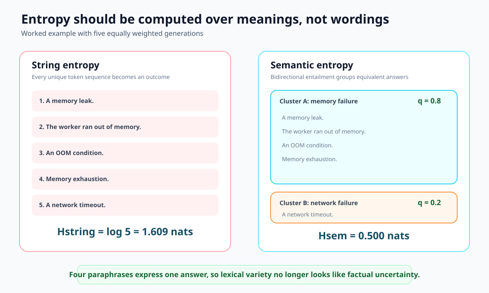
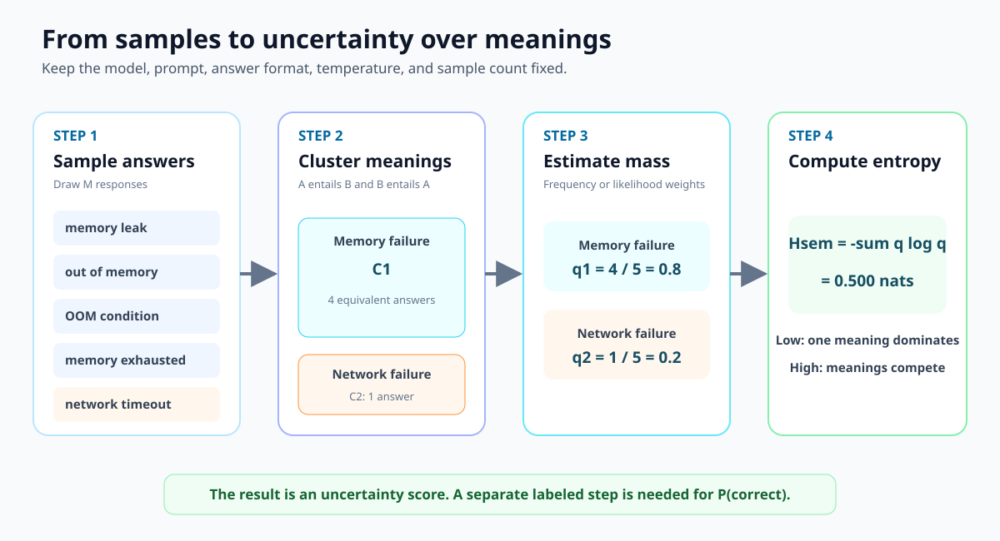
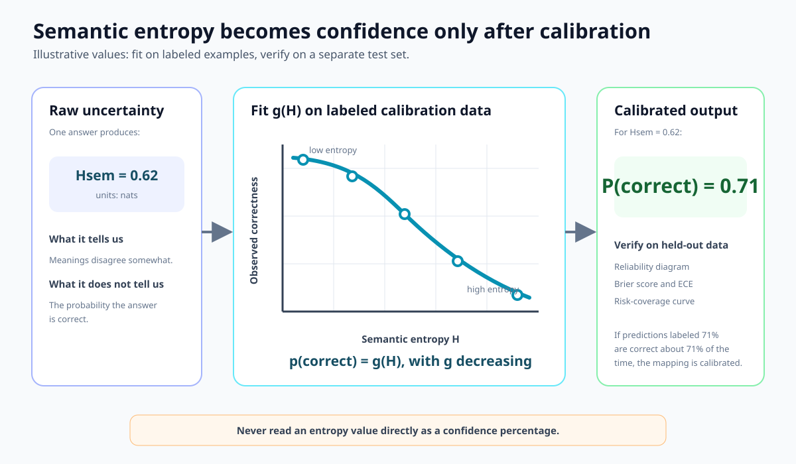

Ask an LLM the same question several times and it may phrase one answer in many
ways. Token-level entropy treats those strings as different outcomes, even when
they mean the same thing. **Semantic entropy** first groups answers by meaning,
then measures how much probability is spread across those meanings.

That makes semantic entropy a useful uncertainty signal for free-form answers.
It does not, by itself, produce a calibrated probability of correctness. A
second, supervised calibration step is required before a system can claim that
an answer is, for example, 80% likely to be correct.

## The problem with entropy over strings

An autoregressive LLM assigns probability to a sequence of tokens:

$$
P(s\mid x)=\prod_i P(t_i\mid x,t_{\lt i}).
$$

This distribution distinguishes every wording. Consider three answers to
"What is the capital of France?":

- `Paris.`
- `The capital is Paris.`
- `France's capital city is Paris.`

Their token sequences differ, but their factual content does not. Entropy over
strings mixes two kinds of variation:

1. **Lexical uncertainty:** which words should express the answer?
2. **Semantic uncertainty:** which answer is actually meant?

Semantic entropy removes the first source as far as the clustering procedure
allows. Answers that entail each other in both directions are placed in the same
semantic equivalence class, following the method introduced by [Kuhn et
al.][semantic-uncertainty] and extended by [Farquhar et al.][semantic-entropy].

## A worked example

Suppose five independent samples answer "What caused the worker failure?":

| Sample | Answer | Semantic cluster |
|---:|---|---|
| 1 | `A memory leak.` | Memory failure |
| 2 | `The worker ran out of memory.` | Memory failure |
| 3 | `An OOM condition.` | Memory failure |
| 4 | `Memory exhaustion.` | Memory failure |
| 5 | `A network timeout.` | Network failure |

If every sampled string receives equal weight, string entropy sees five distinct
outcomes:

$$
H_{\text{string}}=-5\left(\frac{1}{5}\log\frac{1}{5}\right)
=\log 5
\approx1.609\ \text{nats}.
$$

Discrete semantic entropy instead estimates the two cluster probabilities from
their sample frequencies:

$$
q_{\text{memory}}=\frac{4}{5}=0.8,
\qquad
q_{\text{network}}=\frac{1}{5}=0.2.
$$

The entropy over meanings is therefore:

$$
\begin{aligned}
H_{\text{sem}}
&=-\sum_k q_k\log q_k \\
&=-\left(0.8\log0.8+0.2\log0.2\right) \\
&\approx0.500\ \text{nats}.
\end{aligned}
$$

The lower value captures the important fact: four differently worded answers
agree on one cause. There is still uncertainty because one sample proposes a
different cause.

## The technique step by step

The complete pipeline has four stages.

1. **Sample answers.** Draw $M$ responses from a fixed model, prompt, decoding
   temperature, and answer format. The Nature experiments used ten generations
   for their sentence-length evaluations. [Farquhar et al.][semantic-entropy]
2. **Cluster meanings.** Compare answers in the context of the question. Put two
   answers together when each entails the other. An NLI model or an LLM judge can
   perform this bidirectional entailment test.
3. **Estimate cluster mass.** For black-box models, use the fraction of samples
   in each cluster, $q_k=n_k/M$. When sequence probabilities are available, the
   theoretical mass of a cluster $C_k$ is:

   $$
   P(C_k\mid x)=\sum_{s\in C_k}P(s\mid x).
   $$

   A sampled implementation estimates these masses and renormalizes them across
   the observed clusters. Length normalization is often used to reduce the bias
   against longer answers, but it is an implementation assumption that must stay
   fixed during evaluation.
4. **Compute entropy.** For normalized cluster masses $q_1,\ldots,q_K$:

   $$
   \boxed{
   H_{\text{sem}}(x)=-\sum_{k=1}^{K}q_k\log q_k
   }
   $$

Low semantic entropy means the samples concentrate on one meaning. High semantic
entropy means several meanings retain substantial mass.

## Entropy is not calibrated confidence

An entropy of $0.50$ nats does **not** mean a 50% chance of error. Entropy has a
different range and meaning: its maximum is $\log K$ for $K$ equally likely
semantic clusters, and the observed value also depends on sample count and the
decoding policy.

Raw semantic entropy can be evaluated as an uncertainty ranking: do high-entropy
answers fail more often than low-entropy answers? AUROC, risk-coverage curves,
and rank-calibration measure this ordering without pretending the score is a
probability. This matters because uncertainty measures can live on incompatible
scales, as emphasized by [Huang et al.][rank-calibration].

To obtain a probability, collect a labeled calibration set. For each prompt,
compute semantic entropy $H_i$ and record whether the selected answer is correct:

$$
y_i=
\begin{cases}
1 & \text{answer correct},\\
0 & \text{answer incorrect}.
\end{cases}
$$

Fit a non-increasing mapping $g$ from entropy to correctness:

$$
\hat p_i=g(H_i)
\approx P(y_i=1\mid H_i),
\qquad
\frac{dg}{dH}\leq0.
$$

Logistic calibration is a compact choice; isotonic regression is more flexible
when enough labeled data are available. Evaluate the fitted probabilities on a
separate test set using a reliability diagram, Brier score, ECE, and the
operating risk-coverage curve. The broader workflow is covered in the [model
calibration guide](/post/model-calibration-in-llms/).

## What the evidence shows

The original ICLR work found semantic entropy more predictive of question-answer
accuracy than comparable uncertainty baselines across its evaluated datasets
and models. The 2024 Nature study tested sentence-length answers across five
datasets and multiple 7B to 70B model families. Averaged over 30 task-model
combinations, it reported an AUROC of 0.790 for semantic entropy, compared with
0.691 for naive entropy, 0.698 for $P(\mathrm{True})$, and 0.687 for an embedding
regression baseline. Its discrete, frequency-based variant performed similarly
without requiring token probabilities. These are results for the studied setup,
not a universal performance guarantee. [Farquhar et al.][semantic-entropy]

Sampling is the main cost. Semantic entropy normally requires several additional
generations plus semantic comparisons. [Kossen et al.][semantic-entropy-probes]
report a 5 to 10 times generation-cost increase for the sampling method and
propose hidden-state probes that approximate semantic entropy from one
generation. Those probes trade repeated inference for a trained, white-box
component.

## Failure modes

| Failure mode | Why it matters | Practical response |
|---|---|---|
| Consistently wrong answers | Every sample can repeat the same misconception, producing low entropy. | Combine semantic entropy with retrieval, evidence checks, or an external verifier. |
| Bad semantic clusters | Entailment models can merge distinct answers or split harmless paraphrases. | Test clustering on domain examples and include the original question in every comparison. |
| Unstable sampling policy | Temperature, answer length, and $M$ change the entropy distribution. | Freeze these choices before fitting the calibrator. |
| Long, multi-claim answers | A paragraph can agree on one claim and disagree on another. | Decompose the response into atomic claims and score each claim separately. |
| Distribution shift | The entropy-to-correctness mapping can change across tasks or model versions. | Monitor reliability by slice and recalibrate after material changes. |

The method is designed to detect **confabulations**, where sampled meanings vary
because the model lacks a stable answer. It explicitly does not solve systematic
falsehoods that the model repeats confidently. For long passages, the Nature
paper addresses this by extracting factual claims, generating focused questions
for each claim, and computing semantic entropy on the resulting answers.

## A practical recipe

For a production evaluation:

1. Define one observable event, such as "the answer is factually correct."
2. Create disjoint calibration and test sets with trustworthy correctness labels.
3. Sample 5 to 10 concise answers per prompt under a frozen decoding policy.
4. Cluster answers with bidirectional entailment and compute discrete semantic
   entropy first; add likelihood weighting only if it improves held-out results.
5. Fit a non-increasing entropy-to-correctness map on the calibration split.
6. On the test split, report both ranking quality and probability calibration.
7. Set answer, retrieve, verify, or abstain thresholds from the cost of errors.

Semantic entropy is most useful for open-ended questions where many strings can
express the same answer. For constrained multiple choice, normalized choice
probabilities are usually simpler. For source-grounded or high-stakes claims,
semantic entropy should complement evidence verification rather than replace it.

## Bottom line

Semantic entropy asks:

> Do repeated generations agree on the meaning?

Calibration asks a separate question:

> When the system reports 80% confidence, is it correct about 80% of the time?

Use semantic entropy to build the uncertainty signal. Use labeled calibration to
turn that signal into a probability a decision system can safely interpret.

## References

- Kuhn, Gal, and Farquhar, [*Semantic Uncertainty: Linguistic Invariances for Uncertainty Estimation in Natural Language Generation*][semantic-uncertainty] (ICLR 2023).
- Farquhar et al., [*Detecting Hallucinations in Large Language Models Using Semantic Entropy*][semantic-entropy] (Nature, 2024).
- Huang et al., [*Uncertainty in Language Models: Assessment through Rank-Calibration*][rank-calibration] (EMNLP 2024).
- Kossen et al., [*Semantic Entropy Probes: Robust and Cheap Hallucination Detection in LLMs*][semantic-entropy-probes] (2024).

[semantic-uncertainty]: https://openreview.net/forum?id=VD-AYtP0dve
[semantic-entropy]: https://www.nature.com/articles/s41586-024-07421-0
[rank-calibration]: https://aclanthology.org/2024.emnlp-main.18/
[semantic-entropy-probes]: https://arxiv.org/abs/2406.15927
