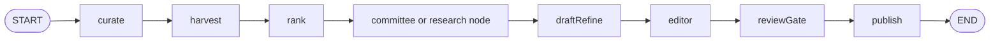
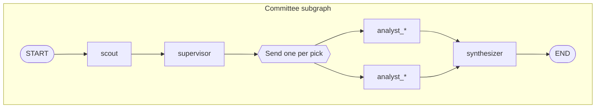

# Blogpipe

Blogpipe turns a stream of research signals (feeds, papers, prior posts) into Hugo-ready blog drafts: it curates a topic, gathers evidence, drafts technical prose, runs a structured editor pass, and optionally generates cover and inline figures. LLM calls are routed through a **task-based model registry** (free and paid chains, USD budgets) with **blacklist-aware fallbacks** when providers rate-limit or drop models.

The orchestration story has two layers:

1. **Linear steps** you can run one at a time: `curate` → `harvest` → `rank` → `research` / committee → `draft` → `edit` → `visuals` → `package`.
2. **End-to-end graph** (`python -m blogpipe graph` or `run`, which also runs visuals and package) that wires those stages in a [LangGraph](https://github.com/langchain-ai/langgraph) `StateGraph` with checkpointing and optional human-in-the-loop before publish.

---

## Install and run

From the repo root:

```bash
pip install ./scripts
export BLOGPIPE_REPO_ROOT="$PWD"   # or rely on auto-discovery via hugo.toml
python -m blogpipe run
```

For development without installing:

```bash
export PYTHONPATH="$PWD/scripts"
export BLOGPIPE_REPO_ROOT="$PWD"
python3 -m blogpipe graph
```

**Commands**

| Command | Role |
|--------|------|
| `curate` | Build editorial brief and candidate pool |
| `harvest` | Ingest and normalize items |
| `rank` | Score and select a primary paper |
| `research` | Single-path evidence bundle (when committee is off) |
| `draft` | Long-form draft from evidence |
| `edit` | Rubric, grounding, glossary/visual embed passes |
| `graph` | Full LangGraph pipeline (draft through publish artifacts) |
| `resume <thread_id>` | Resume a run paused at the review gate (HITL) |
| `visuals` | Cover, diagrams, and planned concept figures |
| `package` | Assemble review bundle (e.g. email HTML) |
| `run` | `graph` + `visuals` + `package` |

Secrets and workflow wiring are described in the repo [`.github/workflows/daily-blog-draft.yml`](../../.github/workflows/daily-blog-draft.yml) and [`../setup-github-secrets.sh`](../setup-github-secrets.sh).

---

## Topic themes

The blog is intentionally narrow. `topics.py` defines the only themes the system will pick from; `rank.py` filters off-topic harvested items and the LLM ranker is told these themes explicitly:

| id | Focus |
|----|-------|
| `llm_scaling` | Scaling LLM training and inference (architecture, optimization, infra) |
| `training_recipes` | Training techniques, recipes, frameworks, pretraining, post-training, RL, datasets |
| `aec_ml` | ML in Architecture, Engineering and Construction (spatial/semantic reasoning, BIM) |
| `new_models` | New models, architectures, benchmarks, novel approaches |
| `problem_oriented_ml` | Unique uses of ML to solve real problems |
| `ml_engineering_deep_dive` | Deeply technical ML engineering discussions |

Knobs:

- `BLOGPIPE_REQUIRE_TOPIC_MATCH=1` (default) drops candidates that match no theme keywords; if the filter would empty the list, the original list is kept and a warning is logged.
- `BLOGPIPE_TOPIC_RELEVANCE_WEIGHT=0.6` boosts each candidate by `weight * (matched_themes / total_themes)` in the heuristic score before LLM ranking.

To extend the surface manually, edit `THEMES` in `scripts/blogpipe/topics.py`.

**Self-updating keywords.** After `node_publish_and_write` writes a draft, `topics.update_themes_from_draft(body, primary_item)` runs a cheap LLM extractor (task `keyword_extract`) over the draft body, filters out stopwords and anything already known, and appends new technical phrases to the **related themes** (those the primary item already matched). The result is persisted in `cache/topic_keywords.json` (capped at `MAX_LEARNED_PER_THEME = 200` per theme and `MAX_LEARNED_PER_DRAFT = 12` additions per run) and merged back in at lookup time via `topics.effective_keywords(...)`. The CI workflow caches and restores this file alongside the other durable memory; `reports/learned_keywords.json` records what was added on the most recent run.

---

## High-level data flow

1. **Curate** produces an `editorial_brief` and shortlists candidates.
2. **Rank** picks a `primary` `Item` and writes `rank_result.json`.
3. **Research (committee or monolithic)** builds an `EvidenceBundle`: paper text, tool traces, optional web/MCP enrichment, a **committee** of parallel analysts (methods, empirical, adversarial, related work, practitioner, code, web, glossary, visual planner), and a **synthesizer** pass that turns analyst notes into a single narrative and structured bundle.
4. **Draft** generates markdown with section-level polish, citation resolution, and optional explainer and **planned visual** embedding from the visual planner.
5. **Editor** runs structural lint, a rubric LLM, numeric grounding against evidence, and records `pass_gate` / `llm_ok` in `editor_report.json`.
6. **Review gate** (graph only) can `interrupt()` for approval when the gate fails, if `BLOGPIPE_AUTO_APPROVE=0` and a checkpointer is configured.
7. **Publish** writes the post under `content/post/`, static assets under `static/img/posts/...`, and reports under `reports/` (`editor_report.json`, `research_trace.json`, `llm_usage.json`, `draft_lint.json`, etc.).

---

## LangGraph graph

**Topology** (when `BLOGPIPE_COMMITTEE_DISABLED` is not set):  
`curate` → `harvest` → `rank` → **`committee` subgraph** → `draft_refine` → `editor` → `review_gate` → `publish` → `END`.

### Architecture diagrams

**Main graph** (single compiled `StateGraph` in [`graph/build.py`](graph/build.py)). The graph is built with either a `committee` or a `research` node after `rank`, depending on `BLOGPIPE_COMMITTEE_DISABLED` (not both in one build).



**Committee node** (nested compiled graph in [`graph/committee_subgraph.py`](graph/committee_subgraph.py)): map-reduce via LangGraph `Send` from `supervisor` to each selected `analyst_*` node; all fan in to `synthesizer`. Node names on disk are `analyst_methods`, `analyst_web`, and so on for each entry in `analysts.RUNNERS`.



The drawing shows two analyst branches for clarity; the real graph registers one `analyst_<name>` node per `RUNNERS` entry, and only the supervisor’s picks get a `Send`.

With **`BLOGPIPE_AUTO_APPROVE=0`** and a checkpointer, `reviewGate` can call `interrupt()` when `pass_gate` is false; you resume with `python -m blogpipe resume <thread_id>` and the graph continues toward `publish`.

- **State** is `BlogState` (brief, body, evidence, `committee_notes` with a list reducer, `pass_gate`, etc.); see [`graph/state.py`](graph/state.py).
- **Checkpointing** defaults to `cache/graph.sqlite` (override with `BLOGPIPE_CHECKPOINT_PATH`). Use a stable `BLOGPIPE_THREAD_ID` (e.g. CI sets `gh-<run_id>`) to resume the same run.
- **Streaming**: `BLOGPIPE_STREAM=1` (default) logs per-node `stream_mode="updates"` chunks; set `BLOGPIPE_STREAM=0` for a single `invoke`.
- **Retries** on transient HTTP/JSON errors use LangGraph’s `retry=` on each node; analyst nodes can still return `skipped` notes for non-transient errors.

Configuration knobs include `BLOGPIPE_SUPERVISOR` (use LLM routing vs. full `BLOGPIPE_COMMITTEE_ANALYSTS` list), `BLOGPIPE_AUTO_APPROVE` (skip HITL; default on for automation), and optional LangSmith env vars for tracing when enabled in CI.

---

## Notable packages

| Area | Module(s) |
|------|------------|
| LLM calls | `llm_chain.py`, `openrouter_client.py`, `model_registry.py` |
| Research | `research.py`, `paper_reader.py`, `mcp_enrichment.py` |
| Committee analysts | `analysts/` |
| Graph | `graph/build.py`, `graph/nodes.py`, `graph/committee_subgraph.py`, `graph/supervisor.py`, `graph/runner.py` |
| Draft & lint | `draft.py`, `lint.py`, `critics.py` |
| Artifacts | `visuals.py`, `package.py`, `memory.py` (`memory.STATIC_IMG_POSTS` → `static/img/posts/{slug}/` for cover, hero, `diagram.svg`, and `figures/*.png`) |

---

## Testing

```bash
PYTHONPATH=scripts python3 -m pytest tests/ -q
```

Python version and dependencies are declared in [`../setup.cfg`](../setup.cfg).
